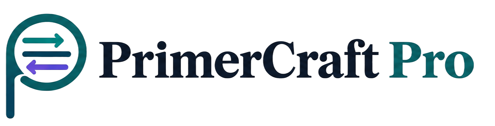

<div align="center">



# PrimerCraft Pro

**Diseño y puntuación automática de primers para PCR/qPCR**

**Trabajo Final — Ingeniería de Software (2026)**

**[Ver la documentación publicada](https://matiasriosmr.github.io/PrimerCraft-Pro-2026/)**

</div>

---

## Integrantes

- Barbara Sara
- Vergara Emilia
- Rios Matias

**Carrera:** Licenciatura en Bioinformática

**Institución:** Facultad de Ingeniería, Universidad Nacional de Entre Ríos (FIUNER)

---
## Sobre el proyecto

**PrimerCraft Pro** es una herramienta que diseña y puntúa automáticamente pares de primers para PCR/qPCR a partir de una secuencia blanco, garantizando la trazabilidad e integrando en un solo flujo:

- **Cálculo termodinámico** (Tm, %GC)
- **Detección de estructuras secundarias** (hairpins, dímeros) y **variantes**
- **Simulación del amplicón**
- **Verificación de especificidad**

Está pensada para investigadores/as de biología molecular que hoy alternan entre múltiples herramientas dispersas (NCBI, Primer3/Primer-BLAST, verificadores de estructura) para llegar al mismo resultado.

Para profundizar más sobre esto, ir a: [`docs/requirements/srs.md`](docs/requirements/srs.md)


---

## Modelo de ciclo de vida

Se elige el ciclo de vida **Iterativo e Incremental** porque permite construir la herramienta por etapas, entregando primero el núcleo útil del sistema y agregando valor funcional en cada entrega. De forma **incremental**, se puede poner a punto el cálculo básico de primers antes de sumar capacidades más avanzadas como la alerta por variantes poblacionales (SNPs) o el procesamiento automático de listas en lote. De forma **iterativa**, permite ajustar progresivamente aspectos complejos como la conexión con servicios externos (NCBI BLAST), probando primero con una versión simulada antes de implementar la integración definitiva.


---

## Documentación

| Área | Documento | Contenido |
|---|---|---|
| Requerimientos | [`docs/requirements/srs.md`](docs/requirements/srs.md) | SRS: visión y alcance, requerimientos funcionales y no funcionales, casos de uso e historias de usuario |
| | [`docs/requirements/quality-scenarios/quality-scenarios.md`](docs/requirements/quality-scenarios/quality-scenarios.md) | Escenarios de calidad (ISO/IEC 25010) |
| | [`docs/requirements/quality-scenarios/registro-uso-ia.md`](docs/requirements/quality-scenarios/registro-uso-ia.md) | Registro de uso de IA de los escenarios de calidad |
| Arquitectura | [`docs/architecture/contexto_inicial.md`](docs/architecture/contexto_inicial.md) | Diagrama de contexto (DFD nivel 0 y nivel 1) |
| | [`docs/architecture/modelo-dominio-inicial.md`](docs/architecture/modelo-dominio-inicial.md) | Modelo de dominio |
| UX | [`docs/ux/README.md`](docs/ux/README.md) | Índice del diseño de experiencia de usuario |
| | [`docs/ux/user_profile.md`](docs/ux/user_profile.md) | Perfil de usuario, escenarios de uso y flujos de navegación |
| | [`docs/ux/criterios_generacion.md`](docs/ux/criterios_generacion.md) | Criterios de generación de las maquetas |
| | [`docs/ux/heuristic-review/`](docs/ux/README.md#pantallas) | Evaluación heurística de cada pantalla (UI-1 a UI-5) |
| Maquetas | `docs/mockups/` | Maquetas HTML de las 5 pantallas y sus capturas de escritorio y móvil. Para usarlas en el navegador: [UI-1](https://matiasriosmr.github.io/PrimerCraft-Pro-2026/mockups/hu-01-1_nueva-corrida-diseno.html), [UI-2](https://matiasriosmr.github.io/PrimerCraft-Pro-2026/mockups/hu-04_hu-02-1_progreso-corrida.html), [UI-3](https://matiasriosmr.github.io/PrimerCraft-Pro-2026/mockups/hu-05_resultados-candidatos.html), [UI-4](https://matiasriosmr.github.io/PrimerCraft-Pro-2026/mockups/hu-03-1_validar-primer.html), [UI-5](https://matiasriosmr.github.io/PrimerCraft-Pro-2026/mockups/hu-03-3_resultado-validacion.html) |
| Marca | `docs/marca/` | Isotipo y logotipo del grupo |
| Uso de IA | [`uso_de_ia/uso_de_ia.md`](uso_de_ia/uso_de_ia.md) | Registro general de uso de IA generativa, actualizado TP a TP |

## Estructura del repositorio

```
PrimerCraft-Pro-2026/
├── docs/
│   ├── requirements/   # SRS y escenarios de calidad
│   ├── architecture/   # diagrama de contexto y modelo de dominio
│   ├── ux/             # perfil, criterios y evaluaciones heurísticas
│   ├── mockups/        # maquetas HTML y capturas (capturas/, capturas/movil/)
│   └── marca/          # isotipo y logotipo
├── src/                # código fuente
├── tests/              # pruebas
└── uso_de_ia/          # registro de uso de IA
```

---

## Licencia

Proyecto académico desarrollado en el marco de la materia **Ingeniería de Software** (FIUNER, 2026). Uso educativo.
