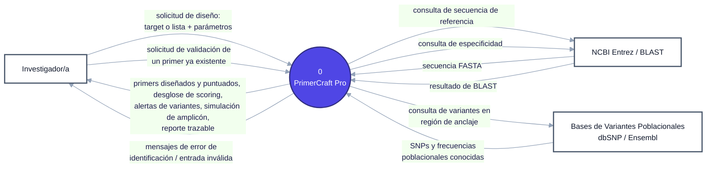
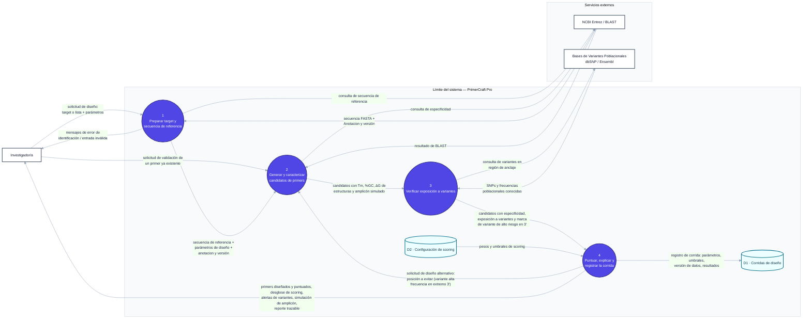

# Diagrama de contexto — PrimerCraft Pro

Diagrama de contexto DFD, Nivel 0 y Nivel 1.

**Fuente (editable):**
- Nivel 0: https://mermaid.ai/app/projects/560fd739-e2f1-40c9-90d8-4d60dadc6181/diagrams/76e3b407-d329-484d-9f7f-064e26a7c54d/version/v0.1/edit?entryPoint=Share+link
- Nivel 1: https://mermaid.ai/app/projects/560fd739-e2f1-40c9-90d8-4d60dadc6181/diagrams/22a5d970-885a-4ae2-b093-6b9a4a6d46a1/version/v0.1/edit?entryPoint=Share+link

## Nivel 0

## Nivel 1

