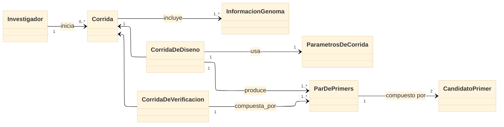

# Modelo de dominio — PrimerCraft Pro

## Cómo se construyó

- Estructura: rectángulo con flechas.
- Nombres semánticos, ligados al vocabulario del dominio (no claves primarias).
- Sin métodos: los nombres reflejan cómo habla del sistema quien lo va a usar, no una perspectiva de implementación.
- Objetivo: que quien resuelve el problema hable de la misma manera que el usuario (lenguaje ubicuo).
- Conceptos del dominio, entidades unidas y sus cardinalidades.

**Fuente (editable):** https://mermaid.ai/app/projects/fe8785b1-f5bb-4a3b-9f4c-41368f8f8917/diagrams/8d382321-b962-435b-99c1-e5cf0ded5771

## Diagrama

