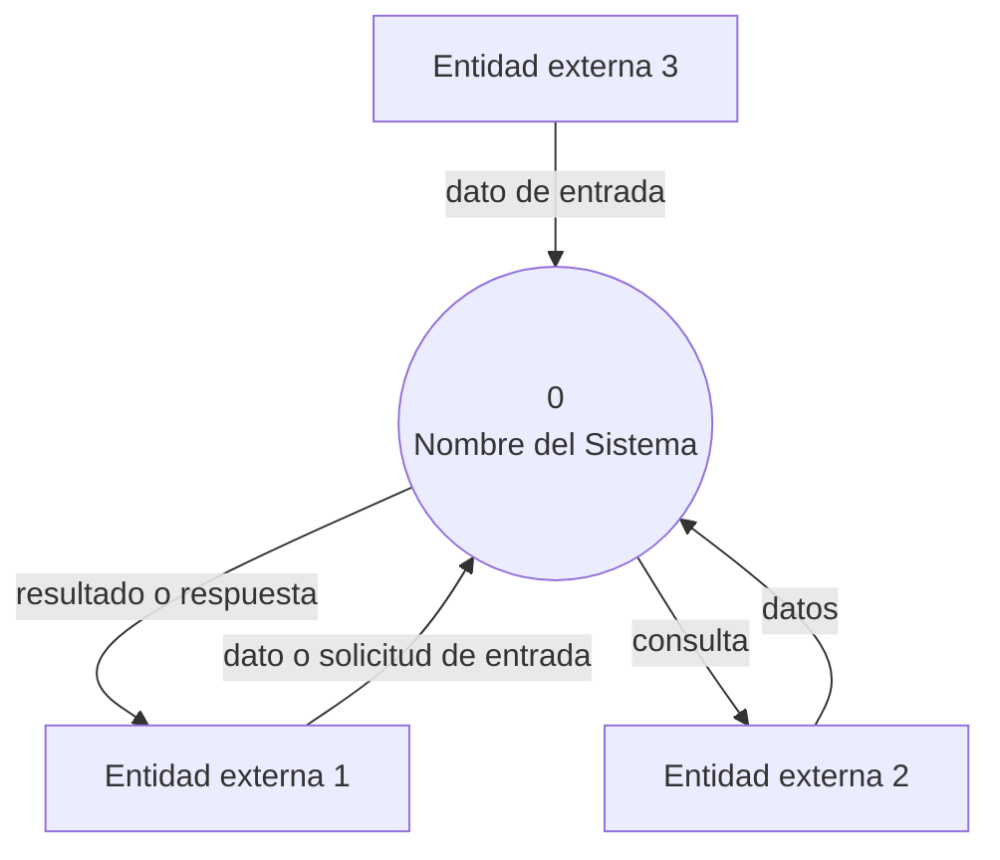
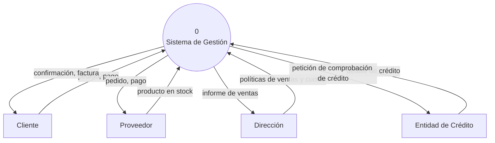

# Instructivo — Diagrama de Contexto (DFD Nivel 0)

**Aplica a:** TP1 (Semana 2) y como referencia para cualquier TP posterior que necesite ubicar un sistema en su entorno.

Adaptado del material de cátedra sobre Diagramas de Flujo de Datos (DFD). Este instructivo cubre únicamente el **Nivel 0** — el diagrama de contexto propiamente dicho. Los niveles 1 y 2 (expansión interna del proceso) no son contenido de esta materia; si en algún momento necesitan descomponer el sistema en procesos internos, eso se hace con el modelo C4 en el TP3, no con más niveles de DFD.

## 1. Qué es un diagrama de contexto

Un DFD es una representación gráfica del flujo de datos a través de un sistema. El **diagrama de contexto (Nivel 0)** es el nivel más general: representa a todo el sistema como un único proceso, junto con sus entidades externas y los flujos de datos entre ambos. No muestra procesos internos, ni almacenes — eso recién aparece a partir del Nivel 1, que queda fuera del alcance de esta materia.

Regla clave del Nivel 0: **un solo proceso, numerado 0**, y sus terminadores alrededor.

## 2. Simbología

| Elemento | Qué representa | Forma clásica |
|---|---|---|
| **Proceso** | El sistema completo (Nivel 0) — transforma entradas en salidas | Círculo/burbuja |
| **Entidad externa (terminador)** | Persona, organización u otro sistema que interactúa con el sistema, pero no forma parte de él | Rectángulo |
| **Flujo de datos** | Datos en movimiento entre el proceso y una entidad externa | Flecha etiquetada |
| **Almacén** | Datos almacenados (base de datos, archivo) | Dos líneas paralelas — **no aparece en el diagrama de contexto**, solo desde Nivel 1 en adelante |

## 3. Reglas de construcción

- **Nombres significativos**: el proceso se nombra con verbo + objeto ("Gestionar análisis de datos", no "Sistema"). Los terminadores, con sustantivos concretos ("Investigador/a", no "Usuario genérico").
- **Numeración**: el proceso del diagrama de contexto siempre es el **0**.
- **No sobrecargar el diagrama**: en Nivel 0 no debería haber más de 4-6 entidades externas — si hay más, probablemente conviene revisar si todas son relevantes al alcance del TP1.
- **Consistencia lógica**: cada flujo tiene que tener sentido en ambas direcciones si corresponde (si el sistema recibe datos de una fuente, y esa fuente espera algo a cambio, ese flujo también debe estar). Evitar flujos sin etiqueta.
- **Todo terminador se conecta al proceso central**: en el Nivel 0 no hay conexiones directas entre entidades externas — todo pasa por el proceso 0.

## 4. Plantilla en Mermaid

Mermaid no tiene un tipo de diagrama DFD nativo, pero sus formas de nodo alcanzan para representar la simbología correctamente: círculo para el proceso, rectángulo para terminadores, flechas etiquetadas para los flujos.



## 5. Ejemplo de referencia

Basado en un sistema de gestión, adaptado con nombres genéricos (el original usa un sistema de pedidos e inventario):



## 6. Checklist antes de commitear el diagrama

- [ ] Hay un único proceso, numerado 0.
- [ ] No aparecen almacenes (eso es Nivel 1, fuera de alcance).
- [ ] Todas las entidades externas y flujos tienen nombre significativo.
- [ ] No hay flujos sin etiqueta.
- [ ] Todos los terminadores se conectan únicamente al proceso central, no entre sí.
- [ ] El diagrama está en un bloque ` ```mermaid ` dentro de un `.md` del repositorio, no como imagen.

---

*Instructivo de la unidad curricular Ingeniería de Software — FIUNER. Adaptado del material de cátedra sobre Diagramas de Flujo de Datos.*
