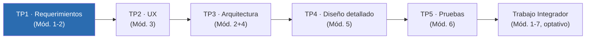
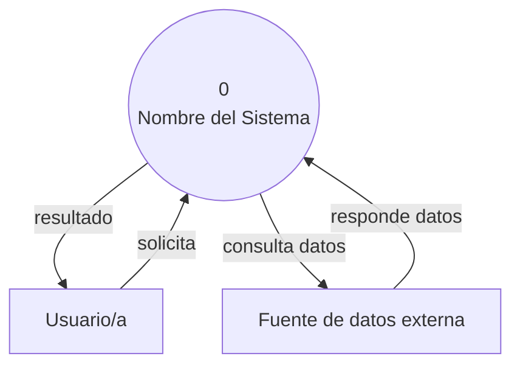

# Ingeniería del Software - 2026 - TP 1

---

# Guía de Trabajo Práctico N.° 1 — Requerimientos del Sistema

| | |
|---|---|
| **Materia** | Ingeniería de Software — Licenciatura en Bioinformática y Licenciatura en Ciencias de Datos (FIUNER) |
| **Módulos** | 1 (El software como producto y procesos) y 2 (Requerimientos y atributos de calidad) |
| **Semanas de trabajo** | 2 (10/08), 4 (24/08) y 5 (31/08) |
| **Presentación (Instancia 1)** | martes 01/09 |
| **Modalidad** | grupal |
| **Plataforma única** | GitHub (código, documentación y control de versiones) |

> Este TP es el punto de partida de un proyecto que el grupo va a construir de forma incremental durante todo el cuatrimestre. Lo que se decide y documenta acá — el dominio, los stakeholders, el alcance — es la base sobre la que se apoyan la arquitectura (TP3), el diseño (TP4) y las pruebas (TP5). Documentar bien ahora ahorra trabajo (y discusiones) después.

---

## 1. Objetivos de aprendizaje

Al finalizar este TP, cada integrante del grupo debería poder:

- Comprender el software como producto de ingeniería —"la aplicación de un enfoque sistemático, disciplinado y cuantificable para el desarrollo, operación y mantenimiento del software" (definición IEEE, Módulo 1)— y distinguirlo de la programación como actividad individual.
- Describir y comparar los modelos de ciclo de vida del software —secuenciales, iterativos, incrementales, ágiles— y aplicar criterios propios para seleccionar el modelo adecuado al proyecto (ver secc. 3.1).
- Identificar las causas recurrentes de fracaso en proyectos de software (Módulo 1: problemas de duración, costo, compromisos y manejo de desvíos) y anticipar cuál de ellas es más probable en el proyecto propio.
- Aplicar al menos una técnica de elicitación de requerimientos sobre un dominio de datos real, elegido por el propio grupo.
- Distinguir requerimientos funcionales de atributos de calidad (no funcionales) y expresarlos con precisión.
- Redactar casos de uso en formato textual (Cockburn) y/o historias de usuario, con criterios de aceptación verificables — y conocer las reglas de notación UML de casos de uso (actores, `<<include>>`/`<<extend>>`, límite del sistema) lo suficiente como para representarlas a mano si se solicita.
- Construir un modelo de dominio inicial: las entidades y relaciones esenciales del problema.
- Dejar el repositorio Git del grupo configurado y con evidencia real de proceso desde el primer commit.

---

## 2. Modalidad de trabajo

- Grupos de **2 a 3 estudiantes**.
- Cada grupo **propone y desarrolla su propio caso de estudio**, y lo sostiene durante todo el cuatrimestre. No hay caso de estudio provisto por la cátedra — ni en este TP ni en los siguientes.
- El proyecto surge de un **área de dolencia, necesidad o interés** que el propio grupo identifique — no tiene que ser necesariamente del ámbito biológico o clínico: puede ser cualquier dominio de datos que a algún integrante del grupo le resulte relevante o le genere curiosidad genuina. Esa elección es, de hecho, la primera actividad del TP1 (sección 4).
- Esta decisión aplica a **todo el cuatrimestre**: la actividad de descubrimiento del TP1 es también la instancia formal de selección y validación del proyecto. No se repite ni se reabre en los TP siguientes — el caso de estudio elegido y aprobado acá es el que se construye hasta el Trabajo Integrador.
- La propuesta de cada grupo requiere **aprobación del docente** antes de avanzar con el resto del TP1 (ver checklist de la sección 4).

---

## 3. Marco general: un ciclo de vida que se recorre en el cuatrimestre

El proyecto no se construye de una sola vez ni de punta a punta antes de mostrar nada: se construye de forma **iterativa e incremental**, un TP a la vez, y cada instancia de presentación es un punto de control (una revisión, no un examen sobre teoría suelta). El TP1 fija la primera iteración.



### 3.1 Actividad: elegir y justificar el modelo de ciclo de vida del proyecto (Semana 2)

Esta actividad se hace junto con la actividad de descubrimiento (sección 4), en la primera sesión de práctica del TP1 — es una de las primeras decisiones de ingeniería documentadas del proyecto.

Cada grupo debe **seleccionar el modelo de ciclo de vida** (cascada, iterativo, incremental, espiral, basado en componentes, ágil, o una combinación) que va a guiar la construcción de su proyecto, y justificar esa elección con criterios propios — no alcanza con nombrar el modelo.

Para fundamentar la decisión, indaguen qué atributos del proyecto condicionan o habilitan la elección de un modelo u otro. Algunos ejemplos de esos atributos: grado de claridad y estabilidad de los requerimientos, tamaño y disponibilidad del equipo, tolerancia al riesgo del proyecto, necesidad de mostrar valor tempranamente, existencia de componentes o librerías reutilizables, y restricciones de tiempo o de entrega. Investiguen las características, ventajas y desventajas de cada modelo, y usen esos atributos para argumentar por qué el modelo elegido es el más adecuado para su proyecto puntual.

Preguntas guía para la decisión:

- ¿Qué tan claros están hoy los requerimientos del proyecto? ¿Es esperable que cambien a medida que entienden mejor el dominio?
- ¿Hay un núcleo mínimo de valor que se pueda entregar temprano?
- ¿Qué riesgo puntual de este proyecto conviene gestionar con iteraciones cortas?
- ¿Van a incorporar alguna práctica ágil concreta (sprints, tablero, reuniones breves)? ¿Cuál y por qué?

La decisión y su justificación (3 a 5 líneas, citando al menos dos atributos propios del proyecto) se documentan en el `README.md` — es el mismo ítem que ya figura en el checklist de entregables (sección 7).

Esto conecta directamente con el principio de **anticipación del cambio**, uno de los principios fundamentales de la Ingeniería de Software: el software cambia por naturaleza —por la evolución del dominio, por requerimientos que se ajustan, por decisiones que se revisan— y ese cambio se gestiona con las herramientas adecuadas para almacenar y recuperar versiones de manera controlada. Esa es, en definitiva, la razón de fondo por la que el repositorio Git se abre desde el primer día del TP1 y no recién en el Módulo 7.

---

## 4. Actividad de descubrimiento (inicio de Semana 2)

Antes de escribir una sola historia de usuario, el grupo necesita tener claro **qué va a construir y para quién**. Esta actividad se hace en grupo, en la primera sesión de práctica del TP1, y no requiere código ni herramientas todavía — solo papel, pizarra o un documento compartido temporal. Como no hay caso de estudio provisto por la cátedra, esta actividad es también la instancia en la que el grupo define y valida su proyecto para todo el cuatrimestre.

### 4.1 Punto de partida: área de dolencia o interés

Antes del canvas, el grupo elige el área sobre la que va a trabajar. No hace falta un problema perfectamente definido todavía — alcanza con un área de dolencia (algo que no funciona bien, que consume tiempo, que genera errores) o de interés genuino de alguno de los integrantes. Puede ser un problema del ámbito biológico o clínico, pero no tiene por qué serlo: cualquier dominio de datos real —ambiental, social, deportivo, económico, educativo, etc.— es válido, siempre que permita construir un sistema de software con datos reales o razonablemente simulables.

Esta elección es la que se termina de precisar con el canvas de la sección 4.2, y queda sujeta a **aprobación del docente** antes de continuar con el resto del TP1.

### 4.2 Canvas de descubrimiento

Cada grupo completa el siguiente **canvas de descubrimiento** discutiendo en voz alta cada punto (no alcanza con completarlo individualmente y sumar respuestas):

| Bloque | Preguntas guía |
|---|---|
| **Dominio y problema** | ¿Qué problema real van a atacar, dentro del área elegida en 4.1? ¿Quién lo sufre hoy y cómo lo resuelve actualmente (planillas, scripts sueltos, herramientas dispersas)? |
| **Datos** | ¿Qué tipo de datos maneja el sistema (biológicos, clínicos, ambientales, transaccionales, textuales, u otro tipo, según el dominio elegido)? ¿De dónde vienen? ¿Qué formato tienen (CSV, JSON, FASTA, VCF, texto libre, etc., según corresponda)? |
| **Usuarios y stakeholders** | ¿Quién va a usar el sistema? ¿Hay más de un perfil? ¿Quién más tiene interés en el proyecto aunque no lo use directamente? |
| **Valor** | Si el sistema funciona, ¿qué cambia para el usuario? ¿Qué decisión o tarea se vuelve más rápida, más confiable o directamente posible? |
| **Alcance realista** | ¿Qué es lo mínimo que, construido en un cuatrimestre por 2 a 3 personas, ya demuestra el valor central? ¿Qué queda deliberadamente afuera? |
| **Riesgos de fracaso** (Módulo 1, "problemas en requerimientos de software") | De los problemas típicos que ven en teoría —*¿qué es lo que se necesita?* (visión poco clara de los stakeholders), *incertidumbre al inicio*, *cambio de requerimientos*, *negociación de requerimientos* entre stakeholders con intereses distintos—, ¿cuál es el más probable en este proyecto puntual, y qué van a hacer para mitigarlo? |
| **Datos sensibles** (conecta con Módulo 1, ética profesional) | Si el sistema maneja datos personales identificables (biológicos, clínicos, o de cualquier otro tipo asociados a una persona), ¿qué implica eso en términos de confidencialidad y privacidad? El Código de Ética IEEE/ACM exige proteger la privacidad de los usuarios como parte del interés público — vale la pena dejarlo escrito desde ahora, aunque el sistema no se implemente todavía. |

### 4.3 Dónde se documenta el resultado

El canvas **no queda como un ejercicio suelto de pizarra**: pasa a ser la sección inicial del SRS del proyecto (`docs/requirements/srs.md` — ver estructura recomendada en la sección 6), típicamente como "Visión y alcance" o "Descripción general", según la plantilla de SRS que use el grupo. Es un artefacto formal, versionado y con su propio historial de commits, no una nota de referencia.

El `README.md` del repositorio sí queda más liviano: una síntesis de 3-4 líneas (qué se construye, para quién) con un link a la sección correspondiente del SRS — su función es orientar a quien llega al repositorio, no duplicar el contenido completo.

### 4.4 Salida de la actividad: diagrama de contexto inicial (DFD Nivel 0)

Como cierre de la actividad de descubrimiento, el grupo produce un **diagrama de contexto** siguiendo la notación de Diagrama de Flujo de Datos (DFD) Nivel 0: el sistema completo como un único proceso (numerado 0), sus entidades externas y los flujos de datos entre ambos. La simbología completa, las reglas de construcción y una plantilla en Mermaid están en [`docs/instructivos/diagrama-de-contexto-dfd.md`](../instructivos/diagrama-de-contexto-dfd.md).



Este diagrama se escribe directamente como bloque Mermaid en un archivo `.md` del repositorio (por ejemplo, dentro del propio SRS o en `docs/architecture/contexto-inicial.md`) — nunca como imagen pegada.

### 4.5 Especificación de casos de uso: formato textual, no diagrama

Los casos de uso de este TP se redactan en **formato textual estructurado (Cockburn)** — actor, precondición, flujo principal, flujos alternativos, postcondición — y no como diagrama gráfico UML de casos de uso.

La razón es técnica, no una simplificación: Mermaid (la única herramienta de diagramación del curso, por la regla de todo-en-GitHub) no incluye un tipo de diagrama de casos de uso nativo. Una aproximación mediante `flowchart` no respeta la semántica de la notación UML de casos de uso (actor, caso de uso, límite del sistema, relaciones de inclusión y extensión), por lo que produce un artefacto visualmente similar pero conceptualmente incorrecto, con el riesgo adicional de inducir a error sobre la notación real.

> **Esto no exime de saber la notación.** El diagrama de casos de uso UML —actor, elipse de caso de uso, límite del sistema, relaciones `<<include>>` y `<<extend>>`, generalización de actores— sigue siendo contenido exigible del curso. El grupo debe poder **dibujarlo a mano y explicarlo** (en el pizarrón, en una hoja, o verbalmente) durante las clases de práctica y en la Instancia 1, si el docente lo solicita. No entregar el diagrama gráfico como artefacto del repositorio no significa no saberlo — significa que el repositorio no es el lugar para una notación que la herramienta del curso no soporta correctamente.

---

## 5. Trabajo semana a semana

| Semana | Fecha | Foco | Artefactos que avanzan |
|---|---|---|---|
| 2 | 10/08 | **Inicio** — elección de área de dolencia/interés, actividad de descubrimiento, identificación de stakeholders, exploración del dominio | Sección inicial del SRS (visión y alcance), lista de stakeholders, diagrama de contexto inicial (DFD Nivel 0) |
| 3 | 17/08 | **Feriado nacional (Paso a la Inmortalidad del Gral. San Martín) — sin sesión de práctica.** El grupo puede seguir commiteando avances por su cuenta, pero no hay actividad de cátedra pautada esta semana. | — |
| 4 | 24/08 | **Trabajo** — modelo de dominio refinado, casos de uso detallados, historias de usuario con criterios de aceptación | Modelo de dominio (Mermaid ER o de clases conceptual), CU/HU |
| 5 | 31/08 | **Cierre** — especificación detallada de un caso de uso/HU representativo, preparación de la presentación | SRS consolidado, atributos de calidad según ISO 25010 con sus escenarios de calidad correspondientes, primera línea base del repositorio (tag `v1.0.0`) |
| — | 01/09 | **Instancia 1** — presentación oral (Módulos 1+2) | Defensa de decisiones ante el docente |

No hace falta esperar a la Semana 5 para escribir el SRS: se construye de forma incremental, con commits frecuentes desde la Semana 2 (ver sección 6). La especificación de requerimientos no funcionales avanza en la práctica progresivamente junto con los funcionales; los escenarios de calidad (fuente–estímulo–artefacto–entorno–respuesta–medida) se redactan en más de una variante por atributo, cubriendo distintas condiciones de entorno — la cantidad exacta y el criterio de cobertura los define el docente.

---

## 6. Arranque de la Administración de la Configuración (Git/GitHub)

Desde este primer TP, el repositorio **es** parte del proyecto, no un lugar donde se sube el resultado al final. Todo el grupo trabaja sobre la misma rama (`main`) durante el TP1 — todavía no se introduce branching, eso llega en el TP2.

### 6.1 Crear el repositorio (Semana 2, primeros 20-30 minutos)

- [ ] Crear un repositorio en GitHub, uno por grupo (nombre sugerido: `[nombre-tentativo-del-sistema]-2026`).
- [ ] Agregar a todos los integrantes del grupo como colaboradores.
- [ ] Crear la estructura inicial de carpetas:

```
[nombre-sistema]-2026/
├── docs/
│   ├── requirements/      ← SRS, historias de usuario, casos de uso
│   ├── architecture/      ← se completa desde el TP3
│   └── ux/                ← se completa desde el TP2
├── src/                   ← se completa desde el TP4
├── tests/                 ← se completa desde el TP5
└── README.md
```

- [ ] Escribir el `README.md` inicial con: nombre del proyecto, integrantes, y una síntesis breve del canvas de descubrimiento (problema, usuarios, alcance).
- [ ] Agregar un `.gitignore` apropiado para Python (o R, según el stack que anticipen usar).
- [ ] Primer commit: `chore: estructura inicial del repositorio`.

### 6.2 Commits durante el TP1

Cada historia de usuario o caso de uso que se agrega al SRS se commitea con su propio identificador desde el principio — esto es lo que después, en el Módulo 7, se formaliza como trazabilidad. Convención sugerida:

```
docs: agrega HU-01 al SRS — carga de archivo de datos de entrada
docs: agrega HU-02 al SRS — validación de calidad de los datos cargados
docs: agrega modelo de dominio inicial v0.1
docs: agrega lista de stakeholders y roles identificados
docs(requerimientos): agrega atributos de calidad — rendimiento y usabilidad
```

Commits pequeños y frecuentes (al final de cada sesión de trabajo, como mínimo) valen más como evidencia de proceso que un único commit gigante la noche anterior a la presentación — y la planificación de la materia lo dice explícitamente: la historia de commits es parte de la evidencia evaluable.

### 6.3 Cierre del TP1: primera línea base

El día antes de la presentación, una vez que todo esté commiteado:

```bash
git tag -a v1.0.0 -m "Línea base TP1: requerimientos aprobados para presentación 01/09"
git push origin v1.0.0
```

Esta etiqueta marca formalmente la primera línea base del proyecto — el punto de referencia contra el que se comparan los cambios futuros.

> **Documentación y diagramas:** todo el SRS se escribe en Markdown y todos los diagramas (contexto, modelo de dominio) en Mermaid, dentro de los `.md` del repositorio — no como capturas de pantalla ni documentos externos. Si el grupo no tiene a mano las convenciones completas (estructura de carpetas detallada, ejemplos de Mermaid por etapa, checklist de entrega), pedir la guía de documentación técnica de la cátedra.

---

## 7. Artefactos a entregar

- [ ] `README.md` liviano, con síntesis de 3-4 líneas del proyecto y link a la sección de visión/alcance del SRS (ver secc. 4.3), más el modelo de ciclo de vida elegido con su justificación (ver secc. 3.1).
- [ ] Lista de stakeholders y usuarios, con roles.
- [ ] Diagrama de contexto inicial en notación DFD Nivel 0 (Mermaid — ver secc. 4.4 e instructivo `docs/instructivos/diagrama-de-contexto-dfd.md`).
- [ ] Modelo de dominio inicial (Mermaid — diagrama ER o de clases conceptual).
- [ ] Casos de uso en formato textual Cockburn (ver secc. 4.5) y/o historias de usuario con criterios de aceptación verificables (formato *Como… quiero… para…*, criterios en estilo Given-When-Then si el grupo ya lo maneja). Sin diagrama gráfico de casos de uso en el repositorio — ver por qué en secc. 4.5.
- [ ] Atributos de calidad identificados según ISO 25010, con sus escenarios de calidad correspondientes (fuente–estímulo–artefacto–entorno–respuesta–medida), cubriendo más de una condición de entorno por atributo — cantidad exacta a definir por el docente.
- [ ] SRS consolidado en `docs/requirements/`, con la sección de visión y alcance surgida del canvas de descubrimiento (secc. 4.2-4.3).
- [ ] Bitácora de uso de IA (`docs/uso-ia.md`) — ver sección 8.
- [ ] Repositorio con historial de commits real y tag `v1.0.0`.

## 8. Tarea de uso crítico de IA

Como en todos los TP de la materia, hay una tarea explícita de uso y análisis de herramientas de IA generativa. Para el TP1, por ejemplo: usar un asistente de IA para ayudar a redactar historias de usuario o criterios de aceptación a partir del canvas de descubrimiento. Documentar en `docs/uso-ia.md`:

- Qué herramienta se usó y para qué tarea puntual.
- Qué generó la IA (sin pegar el contenido completo si es extenso — alcanza con una síntesis o un fragmento representativo).
- Qué se modificó, aceptó o descartó del resultado, y **por qué**.
- Qué error o imprecisión detectó el grupo, si hubo alguno.

Esta reflexión es parte de lo que se evalúa en la Instancia 1, no un anexo opcional.

---

## 9. Instancia 1 — qué se defiende (01/09)

La presentación es oral y grupal. El docente evalúa, según la rúbrica de la materia:

1. **Calidad técnica** del SRS y los artefactos (corrección, completitud, precisión).
2. **Comprensión real del dominio** elegido por el grupo (no aplicación mecánica de una plantilla genérica).
3. **Argumentación oral**: por qué estas historias de usuario, por qué estos atributos de calidad, qué alternativas se descartaron y por qué.
4. **Reflexión sobre el uso de IA**: honesta, específica, con pensamiento crítico.
5. **El repositorio Git como evidencia del proceso**: historial de commits, no solo el resultado final.

Preguntas que conviene poder responder sin dudar: *¿por qué eligieron este alcance y no uno más amplio o más acotado? ¿Qué stakeholder quedó fuera de la primera versión y por qué? ¿Qué requerimiento fue el más difícil de acotar y cómo lo resolvieron?*

> El docente puede pedir, sin previo aviso, que el grupo **dibuje en el pizarrón** el diagrama UML de casos de uso correspondiente a una de las especificaciones textuales entregadas (actor, límite del sistema, `<<include>>`/`<<extend>>`). No entregar el diagrama como artefacto no implica no tener que saberlo — ver secc. 4.5.

---

## 10. Checklist final antes de presentar

- [ ] Todos los `.md` están commiteados en el repositorio del grupo (no en Google Docs, Word ni Notion).
- [ ] Los diagramas están en bloques ```` ```mermaid ```` dentro de archivos `.md`, no como imágenes pegadas.
- [ ] El SRS cubre requerimientos funcionales y atributos de calidad, con los escenarios de calidad correspondientes a cada atributo.
- [ ] Cada historia de usuario/caso de uso tiene criterios de aceptación verificables.
- [ ] `docs/uso-ia.md` está actualizado.
- [ ] El tag `v1.0.0` está creado y publicado (`git push origin v1.0.0`).
- [ ] Todos los integrantes pueden explicar y defender cualquier decisión del documento, no solo la parte que escribieron.

---

## Referencias rápidas

**Material de cátedra (Módulo 1):** Introducción a la Ingeniería de Software · La Crisis del Software · Fracasos por el Software · Consecuencias de la Mala Calidad · La Ingeniería de Software · Principios de la Ingeniería de Software · SWEBOK · Ética Profesional · La Problemática. Estos nueve documentos son la base directa de la sección 1 (objetivos), la sección 3 (marco de ciclo de vida) y las filas de "riesgos de fracaso" y "datos sensibles" del canvas de descubrimiento (sección 4).

**Bibliografía complementaria (Módulo 2, requerimientos):**

- Sommerville, I. *Ingeniería del Software* (10.ª ed.), capítulos 4 y 5 — ingeniería de requerimientos.
- Wiegers, K. y Beatty, J. *Software Requirements* (3.ª ed., 2013) — el más práctico para redactar requerimientos concretos.
- Cockburn, A. *Writing Effective Use Cases* (2000), capítulos 1–3.
- Material de cátedra sobre Diagramas de Flujo de Datos (DFD) — base del instructivo `docs/instructivos/diagrama-de-contexto-dfd.md`, usado para el diagrama de contexto de la sección 4.4.
- ISO/IEC 25010 — modelo de calidad del producto: [iso25000.com](https://iso25000.com/index.php/normas-iso-25000/iso-25010).
- Criterio **INVEST** para evaluar historias de usuario (Independiente, Negociable, Valiosa, Estimable, Small, Testeable).
- Criterios de aceptación en formato **Given-When-Then** (estilo BDD) — se conecta directamente con el Módulo 6 (Pruebas) más adelante en el cuatrimestre.

---

*Guía de Trabajo Práctico N.° 1 — Ingeniería de Software, Licenciatura en Bioinformática y Licenciatura en Ciencias de Datos, FIUNER.*
