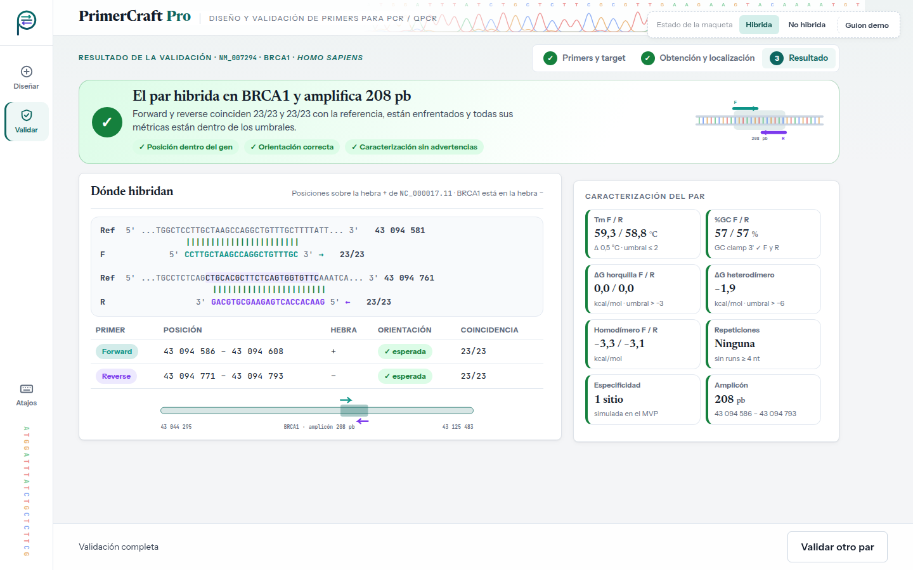
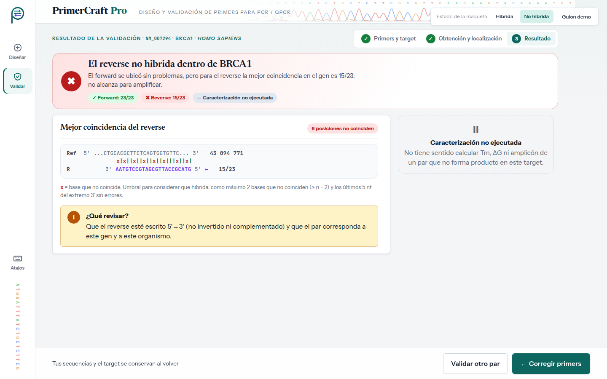

# Evaluación heurística — UI-5 · Resultado de validación

| | |
|---|---|
| **HU** | HU-03.3 · Verificación de hibridación y caracterización (CU-03, Slice 3) |
| **Perfil** | [`perfil-investigador.md`](../user-profiles/perfil-investigador.md) |
| **Escenario de uso** | Escenario B — Validar un par diseñado por otro medio |
| **Maqueta** | [`hu-03-3_resultado-validacion.html`](../mockups/hu-03-3_resultado-validacion.html) |
| **Herramienta IA** | Claude (generación) · Claude Code (iteración 2: JavaScript y panel) · Gemini (evaluación, en una conversación nueva) |

---

## Ciclo 1 — Generación del maquetado

### Prompt utilizado

```text
Actuá como diseñador/a de interfaces. Generá el maquetado en HTML de UNA pantalla de
"PrimerCraft Pro", una aplicación web para diseñar primers de PCR/qPCR.

CRITERIOS: <los mismos criterios que en UI-1 (ver criterios_generacion.md)>

USUARIO (perfil): <mismo perfil que en UI-1>

ESCENARIO: el sistema ya obtuvo la referencia de NM_007294 y localizó BRCA1. Laura quiere
saber si el par que pegó hibrida en las posiciones y orientación esperadas y ver su
caracterización completa.

HISTORIA HU-03.3: Como investigador/a, quiero que el sistema verifique que mi par de
primers hibrida correctamente en la región objetivo y lo caracterice, para conocer si
es adecuado para amplificar el target.
  1. Localización de los primers → posiciones de forward y reverse.
  2. Verificación de posición y orientación → confirma que hibridan como se espera.
  3. Caracterización → métricas termodinámicas, estructuras secundarias, ΔG y amplicón.
  Además, CU-03 A1: el par no hibrida en la región esperada del gen.
```

> Los marcadores `<…>` remiten a textos ya transcriptos completos en el prompt de UI-1 y en el perfil; se abrevian para no repetirlos.

### Respuesta obtenida

HTML: [`../mockups/hu-03-3_resultado-validacion.html`](../mockups/hu-03-3_resultado-validacion.html) (v1, iteración 2).

### Vista previa (capturas de la versión actual)

**El par hibrida**



**No hibrida (CU-03 A1)**



**Supuestos introducidos por la IA a revisar (iteración 1):**

- Vista de alineamiento primer ↔ referencia con barras de coincidencia.
- Umbral de hibridación "≥ 18/20 y los últimos 5 nt del extremo 3' sin errores". **Lo inventó la IA; el TP1 no lo define.**
- En CU-03 A1 decide **no** ejecutar la caracterización. El TP1 no lo dice explícitamente, aunque HU-03.3 esc. 3 tiene como *Given* que el par hibrida, lo que lo respalda.
- Sugerencia "revisá que el reverse esté escrito 5'→3'".
- Mapa gráfico de la ubicación de los primers en el gen. Datos de ejemplo ilustrativos.

### Iteración 2 del ciclo 1 (30/09) — Interacción con JavaScript y diseño de panel

Antes de correr la evaluación, el grupo cambió dos criterios de generación (ver [`criterios_generacion.md`](../criterios_generacion.md)) y pidió regenerar la maqueta con **Claude Code** sobre la misma base visual:

- **Tecnología:** HTML + CSS + **JavaScript** sin frameworks ni dependencias; el archivo se sigue abriendo con doble clic. El JavaScript va al final del archivo en dos bloques: `interaccion-nucleo` (igual en las cinco pantallas: datos de la corrida entre pantallas, avisos con "Deshacer", atajos de teclado, validaciones compartidas) e `interaccion-pantalla` (el comportamiento propio de esta pantalla). Sin JavaScript, la maqueta se ve como la versión estática.
- **Diseño de panel:** en escritorio la pantalla ocupa exactamente la ventana y no se desplaza; si una columna no entra, se desplaza solo esa columna. En tablet y teléfono se mantiene el desplazamiento normal.

**Qué cambió en esta pantalla:**

- El resultado se calcula con las secuencias que llegan de UI-4: cada primer se busca sobre la región de referencia (aceptando códigos IUPAC) y se aplica el umbral de hibridación.
- "No hibrida" (CU-03 A1) se arma con la mejor coincidencia real: qué primer falla, cuántas bases coinciden y en qué posiciones.
- Si un primer coincide al tomarlo como complemento reverso, se avisa que parece estar en la orientación equivocada.
- Al pasar el mouse o el foco por una fila de la tabla, ese primer se resalta en el alineamiento.
- "Corregir primers" vuelve a UI-4 con las secuencias cargadas; "Validar otro par" conserva el target.

**Supuestos nuevos a revisar:**

- La búsqueda se hace sobre una región de referencia de ~200 pb (la del amplicón de ejemplo), no sobre el gen completo.
- El aviso de orientación equivocada.
- Los casos del botón "Guion demo" (por ejemplo, `NM_999999` → identificador inexistente) son convenciones de la simulación, no reglas del sistema.

> **Al pedir la evaluación:** la pastilla punteada "Estado de la maqueta" y su botón "Guion demo" no son parte de la interfaz. El bloque `<style id="fuentes-embebidas">` (tipografías en base64, ~145 KB) se puede omitir al pegar el HTML.

---

## Ciclo 2 — Evaluación heurística por IA

### Prompt utilizado

```text
Asumí el rol de especialista en interfaz de usuario y usabilidad.
Evaluá esta pantalla de "PrimerCraft Pro" heurística por heurística según las 10
heurísticas de Nielsen, pensando en ESTE usuario y escenario (no uno genérico).
Ignorá la pastilla "Estado de la maqueta" y su botón "Guion demo": no son parte de la
interfaz. La pantalla tiene JavaScript: evaluá también su comportamiento, que está
descrito en los comentarios de los bloques <script>.

PERFIL: <pegar perfil §2>
ESCENARIO: <pegar Escenario B §3.2>
HISTORIA: <pegar HU-03.3 + CU-03 A1>

Para cada heurística: veredicto (CUMPLE / CUMPLE PARCIALMENTE / NO CUMPLE), por qué
(con referencia al elemento del HTML) y, si corresponde, hallazgo y sugerencia.
Numerá los hallazgos (H1, H2, …).
Respondé únicamente con un documento Markdown, sin texto antes ni después, para
guardarlo como archivo .md. Usá exactamente esta estructura:

# Evaluación heurística — <nombre de la pantalla>

## Resumen
| N.° | Heurística | Veredicto | Hallazgos |
(una fila por cada una de las 10 heurísticas; en Hallazgos, los H… o "—")

## 1. Visibilidad del estado del sistema
**Veredicto:** CUMPLE / CUMPLE PARCIALMENTE / NO CUMPLE
**Por qué:** … (con referencia al elemento concreto del HTML)
**Hallazgos:** H… (o "Ninguno")

(repetir la misma sección para las heurísticas 2 a 10)

## Hallazgos
| Hallazgo | Heurística | Severidad (0–4) | Elemento del HTML | Problema | Sugerencia |

HTML:
<pegar el contenido de hu-03-3_resultado-validacion.html, sin el bloque <style id="fuentes-embebidas">>
```

### Respuesta completa de la IA

Respuesta de **Gemini** en una conversación nueva (02/10/2026), pegada sin editar.

<details markdown="1">
<summary>Ver la respuesta completa</summary>

# Evaluación heurística — Resultado de validación (HU-03.3)

## Resumen

| N.° | Heurística | Veredicto | Hallazgos |
|---|---|---|---|
| 1 | Visibilidad del estado del sistema | CUMPLE | — |
| 2 | Relación entre el sistema y el mundo real | CUMPLE | — |
| 3 | Control y libertad del usuario | CUMPLE PARCIALMENTE | H1 |
| 4 | Consistencia y estándares | CUMPLE | — |
| 5 | Prevención de errores | CUMPLE | — |
| 6 | Reconocimiento antes que recuerdo | CUMPLE PARCIALMENTE | H2 |
| 7 | Flexibilidad y eficiencia de uso | CUMPLE PARCIALMENTE | H3 |
| 8 | Estética y diseño minimalista | CUMPLE | — |
| 9 | Ayuda a los usuarios a reconocer, diagnosticar y recuperarse de errores | CUMPLE PARCIALMENTE | H4 |
| 10 | Ayuda y documentación | CUMPLE PARCIALMENTE | H5 |

---

## 1. Visibilidad del estado del sistema

**Veredicto:** CUMPLE  
**Por qué:** La interfaz comunica de forma inmediata y explícita el resultado global de la validación mediante el bloque `.hero`, adaptando su estilo según el estado de la maqueta. En el estado positivo (`#st1`), muestra un banner de confirmación verde con el texto *"El par de primers hibrida correctamente en el gen objetivo"* y los checks de las verificaciones realizadas. En el estado negativo (`#st2`), el banner se transforma en un aviso crítico en rojo indicando *"El par de primers no hibrida en la región esperada"*. Además, el estado de la navegación principal se refleja claramente en la barra lateral con la clase `.on` y el atributo `aria-current="page"`.  
**Hallazgos:** Ninguno

---

## 2. Relación entre el sistema y el mundo real

**Veredicto:** CUMPLE  
**Por qué:** El lenguaje y los símbolos corresponden perfectamente con la jerga y conceptos del laboratorio de biología molecular. Se representan adecuadamente las convenciones biológicas como el alineamiento de hebras (5'→3' / 3'→5'), la complementariedad de bases con código de colores (A, T, G, C), y métricas biofísicas familiares para la investigadora ($T_m$, %GC, $\Delta G$, amplicón). La visualización de la alineación en la etiqueta `<pre class="aln">` simula la salida estándar de herramientas de alineamiento de secuencias del dominio.  
**Hallazgos:** Ninguno

---

## 3. Control y libertad del usuario

**Veredicto:** CUMPLE PARCIALMENTE  
**Por qué:** El usuario puede regresar fácilmente a la pantalla anterior utilizando el botón de la barra de acciones (`.actionbar .btn:contains("Modificar secuencias")`) o el enlace secundario *"Volver a editar secuencias"*. Sin embargo, la barra de acciones fija carece de una vía directa para iniciar un nuevo flujo de trabajo o descargar/exportar el informe de caracterización obtenido sin tener que navegar hacia atrás secuencialmente.  
**Hallazgos:** H1

---

## 4. Consistencia y estándares

**Veredicto:** CUMPLE  
**Por qué:** El diseño mantiene una coherencia visual y de interacción rigurosa con el resto de la aplicación. Utiliza el riel de navegación lateral (`.rail`), la barra superior de la aplicación (`.appbar`), el sistema de tarjetas (`.card`), los badges de estado (`.badge`) y la paleta cromática estandarizada (verde para Forward `--fwd`, violeta para Reverse `--rev`, rojo para errores/mismatches). Las convenciones de teclado estándar (como el salto mediante la tecla Tab y enlaces `skip`) están implementadas adecuadamente.  
**Hallazgos:** Ninguno

---

## 5. Prevención de errores

**Veredicto:** CUMPLE  
**Por qué:** Al ser una pantalla de presentación de resultados derivada del procesamiento de datos previa validación estricta de sintaxis IUPAC en la etapa anterior (HU-03.1/HU-03.2), la interfaz previene lecturas erróneas al deshabilitar o truncar la presentación de análisis secundarios (como las estructuras secundarias o las métricas de par) cuando la hibridación falla (`.view.v2` en `#st2`), evitando que el usuario saque conclusiones falsas a partir de datos no aplicables.  
**Hallazgos:** Ninguno

---

## 6. Reconocimiento antes que recuerdo

**Veredicto:** CUMPLE PARCIALMENTE  
**Por qué:** La pantalla presenta de forma muy clara las métricas de la caracterización (temperaturas de fusión, porcentaje GC, tamaño del amplicón y alineamiento). No obstante, en la vista donde la hibridación no ocurre (`.view.v2`), el sistema informa que las secuencias no se localizaron, pero no muestra en pantalla el organismo de referencia ni las secuencias exactas ingresadas originalmente por el usuario para su contrastación inmediata sin tener que volver a la pantalla de edición.  
**Hallazgos:** H2

---

## 7. Flexibilidad y eficiencia de uso

**Veredicto:** CUMPLE PARCIALMENTE  
**Por qué:** La interfaz provee accesos rápidos mediante teclado (`<kbd>`) para la interacción y permite la navegación adaptativa. Sin embargo, para un usuario experto que requiere documentar su experimento o pasar los datos a un cuaderno de laboratorio digital (ELN) o planilla, la pantalla no ofrece acciones de un solo clic para copiar el alineamiento en formato texto plano, copiar el mapa de la región ni exportar un reporte resumido en PDF/JSON.  
**Hallazgos:** H3

---

## 8. Estética y diseño minimalista

**Veredicto:** CUMPLE  
**Por qué:** La jerarquía visual es excelente. La información se organiza de forma modular mediante tarjetas bien delimitadas, separando el resumen del resultado, la alineación de secuencias, la localización cromosómica en el gen objetivo y el desglose de métricas termodinámicas. No hay elementos decorativos superfluos que distraigan de la tarea de inspección bioinformática.  
**Hallazgos:** Ninguno

---

## 9. Ayuda a los usuarios a reconocer, diagnosticar y recuperarse de errores

**Veredicto:** CUMPLE PARCIALMENTE  
**Por qué:** En el escenario de fallo de hibridación (`.view.v2` / `#st2`), la pantalla diagnostica el problema correctamente indicando que el par no hibrida en la región del gen objetivo. Sin embargo, no ofrece sugerencias de diagnóstico probables que orienten al biólogo sobre la causa raíz (por ejemplo: si las secuencias corresponden a la hebra opuesta sin revertir, si hay diferencias de variante de transcrito, o si el identificador NCBI ingresado no corresponde al lote de primers).  
**Hallazgos:** H4

---

## 10. Ayuda y documentación

**Veredicto:** CUMPLE PARCIALMENTE  
**Por qué:** La interfaz muestra los valores calculados de las métricas termodinámicas ($\Delta G$, $T_m$), pero carece de leyendas explicativas, notas al pie o tooltips informativos que indiquen las condiciones por defecto asumidas en el cálculo (por ejemplo, concentración de sales/monovalentes, concentración de dNTPs y primers) ni los umbrales recomendados de $\Delta G$ para la formación de estructuras secundarias críticas.  
**Hallazgos:** H5

---

## Hallazgos

| Hallazgo | Heurística | Severidad (0–4) | Elemento del HTML | Problema | Sugerencia |
|---|---|---|---|---|---|
| **H1** | 3. Control y libertad del usuario | 2 | `.actionbar` | La barra de acciones solo ofrece la opción de volver a modificar o descargar un reporte, pero no permite reiniciar el proceso directamente para validar otro par distinto. | Agregar un botón o enlace secundario en la barra de acciones como "Validar otro par" que redirija a `hu-03-1_validar-primer.html`. |
| **H2** | 6. Reconocimiento antes que recuerdo | 2 | `.hero.bad` / `.card` en vista de fallo (`.v2`) | Cuando la hibridación falla, la pantalla no muestra cuáles eran las secuencias Forward y Reverse ingresadas ni el ID del target, obligando al usuario a recordar qué ingresó o a volver atrás para verificarlo. | Incluir una sección resumen compacta en el estado de fallo que muestre el identificador NCBI consultado y las secuencias $5'\rightarrow 3'$ evaluadas. |
| **H3** | 7. Flexibilidad y eficiencia de uso | 2 | `.card:has(.aln)` | No existe una función o botón dedicado para copiar el alineamiento en formato texto/FASTA al portapapeles con un solo clic para usarlo en informes o notas de laboratorio. | Incorporar un botón "Copiar alineamiento" (`.btn`) en el encabezado de la tarjeta `.card-h` de la sección de alineamiento. |
| **H4** | 9. Diagnóstico y recuperación de errores | 3 | `.hero.bad` | En caso de no hibridación, el mensaje explicativo es genérico y no ofrece orientación o posibles causas biológicas/técnicas para ayudar a corregir la entrada. | Añadir una lista de verificación de diagnóstico rápida (ej.: "Comprobá si el orden Forward/Reverse está invertido", "Verificá la versión del FASTA/RefSeq en NCBI"). |
| **H5** | 10. Ayuda y documentación | 1 | `.metrics .m` | Las métricas termodinámicas ($\Delta G$) y de alineamiento no especifican los parámetros de reacción asumidos ($[Na^+]$, $[Mg^{2+}]$, concentraciones de oligos) para el cálculo. | Incluir una nota aclaratoria o un enlace/tooltip de ayuda ("?") al pie de la tarjeta de métricas con los parámetros por defecto de cálculo termodinámico. |

</details>

---

## Revisión crítica del grupo

Se verificó cada hallazgo contra el HTML y el JavaScript de la maqueta. De 5 hallazgos, 2 no coinciden con la maqueta (señalan un problema que el HTML no tiene) y 1 es parcialmente cierto; se acepta 1.

| Hallazgo | Heurística | Veredicto de la IA | Decisión | Justificación del grupo |
|---|---|---|---|---|
| H1 | 3. Control y libertad del usuario | CUMPLE PARCIALMENTE · severidad 2 | Rechaza | **No coincide con la maqueta.** "Validar otro par" está en la barra de los dos estados. Además, los botones "Modificar secuencias" y "descargar reporte" que menciona no existen. |
| H2 | 6. Reconocimiento antes que recuerdo | CUMPLE PARCIALMENTE · severidad 2 | Rechaza | **Parcialmente cierto.** Muestra la alineación del reverse con su secuencia contra la referencia de BRCA1, el resultado del forward (20/20) y aclara que las secuencias y el target se conservan al volver. |
| H3 | 7. Flexibilidad y eficiencia de uso | CUMPLE PARCIALMENTE · severidad 2 | Rechaza | Copiar o exportar no está en HU-03.3 y exportar está fuera de alcance según los criterios. |
| H4 | 9. Diagnóstico y recuperación de errores | CUMPLE PARCIALMENTE · severidad 3 | Rechaza | **No coincide con la maqueta.** Ya tiene el bloque "¿Qué revisar?" (reverse escrito 5'→3', no invertido ni complementado, par del gen y organismo correctos) y el umbral usado (≥ 18/20 y 3' sin errores). Es justo lo que sugiere la IA. |
| H5 | 10. Ayuda y documentación | CUMPLE PARCIALMENTE · severidad 1 | **Acepta** | El perfil desconfía de la "caja negra". Sin las condiciones asumidas ([Na⁺], [Mg²⁺], concentración de oligo), el usuario no puede comparar la Tm y el ΔG con los de su herramienta. Alcanza con una nota al pie de las métricas. Aplica también a UI-3. |

**Criterio para decidir:** se acepta si el hallazgo afecta al perfil y al escenario concretos; se rechaza si supone un usuario genérico (por ejemplo, explicar qué es la Tm a alguien con conocimiento de dominio alto), si agrega funciones fuera de la HU o del alcance del SRS, o si contradice el TP1.

---

## Ciclos adicionales

### Ciclo 3 (03/10) — Datos de ejemplo reales de BRCA1

Se reemplazó el par de ejemplo por uno real de BRCA1 (`CCTTGCTAAGCCAGGCTGTTTGC` / `GAACACCACTGAGAAGCGTGCAG`, 208 pb, exón 10 de NM_007294.4), porque el anterior no existía en el gen. En UI-5 cambian la alineación, las posiciones, las métricas y el amplicón; el ejemplo de "No hibrida" ahora es un reverse con 8 bases distintas (15/23) cuya mejor coincidencia se calcula sobre la referencia real. El umbral se expresa como "≥ n − 2" porque los primers ya no miden siempre 20 nt. La interfaz no cambió. Motivo, procedimiento y verificación en el [ciclo 3 de UI-3](hu-05_resultados-candidatos.md#ciclos-adicionales).
