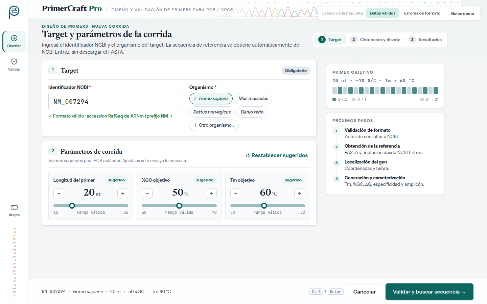
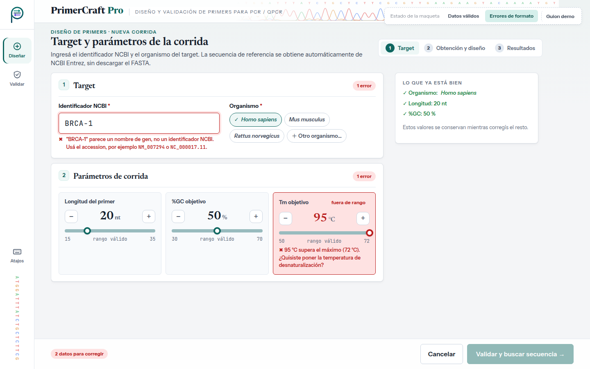

# Evaluación heurística — UI-1 · Nueva corrida de diseño

| | |
|---|---|
| **HU** | HU-01.1 · Iniciar diseño individual de primers (CU-01, Slice 1) |
| **Perfil** | [`user_profile.md`](../user_profile.md) |
| **Escenario de uso** | Escenario A — Diseñar primers para un gen |
| **Maqueta** | [`hu-01-1_nueva-corrida-diseno.html`](../../mockups/hu-01-1_nueva-corrida-diseno.html) |
| **Herramienta IA** | Claude (generación) · Claude Code (iteración 2: JavaScript y panel) · Gemini (evaluación, en una conversación nueva) |

---

## Ciclo 1 — Generación del maquetado

### Prompt utilizado

```text
Actuá como diseñador/a de interfaces. Generá el maquetado en HTML de UNA pantalla de
"PrimerCraft Pro", una aplicación web para diseñar primers de PCR/qPCR.

CRITERIOS (obligatorios):
- Un único archivo HTML5 + CSS embebido, sin frameworks, sin dependencias externas y
  sin JavaScript. Es un maquetado estático; los estados alternativos se muestran con un
  selector hecho solo con CSS, que no es parte de la interfaz.
- Español. Términos técnicos sin traducir (Tm, %GC, nt).
- Escritorio como diseño principal (≥1280 px), responsive: que se adapte a tablet y
  teléfono sin agregar ni quitar funciones.
- Accesible: foco de teclado visible, etiquetas en cada campo, errores vinculados al
  campo y estado del proceso anunciado a lectores de pantalla.
- Estética sobria y formal, a la altura de una herramienta científica: riel lateral
  claro, encabezado con el nombre del producto, tarjetas con bordes suaves, SOLO modo
  claro (sin fondos oscuros). Tipografía formal: serif para títulos (Newsreader),
  sans serif para texto (Instrument Sans) y monoespaciada para secuencias e IDs
  (JetBrains Mono), embebidas en el mismo archivo. Tono impersonal y técnico.
- Imágenes: solo ilustraciones SVG del dominio embebidas (cromatograma, ideograma del
  cromosoma, mapa del gen, doble hélice). Visualizaciones propias del dominio (bases
  coloreadas, mapas del gen, alineamientos) en lugar de tablas planas. Los estados
  siempre con texto o ícono además del color.
- Navegación: riel lateral con "Diseñar" y "Validar" (los dos puntos de entrada).
- Mostrá el estado normal Y los estados de error de la historia. Como no hay JavaScript,
  se alternan con un selector hecho solo con CSS ("Estado de la maqueta").
- NO agregues funciones que no estén en la historia (login, historial, exportar, ranking).

USUARIO (perfil): investigador/a de biología molecular de un laboratorio chico sin
presupuesto para suites pagas. Conocimiento de dominio alto (Tm, ΔG, GC clamp), uso
técnico medio (herramientas web, no programa). Usa computadora de escritorio. Su
frustración: saltar entre NCBI, Primer3 y una planilla, y descargar el FASTA a mano.

ESCENARIO: Laura quiere diseñar primers para BRCA1. Elige "Nueva corrida de diseño",
escribe NM_007294, elige Homo sapiens y deja los parámetros sugeridos
(Tm 60 °C, %GC 50 %, longitud 20 nt).

HISTORIA DE USUARIO (HU-01.1):
Como investigador/a, quiero ingresar el identificador NCBI de mi target, su organismo y
los parámetros de corrida, para que el sistema valide que los datos ingresados tienen un
formato válido antes de realizar la búsqueda de la secuencia de referencia.
Criterios de aceptación:
1. Datos válidos → el sistema valida y permite continuar con la consulta de la referencia.
2. Identificador con formato inválido → informa que no cumple el formato y pide corregirlo.
3. Parámetros inválidos → informa CUÁLES parámetros son inválidos y pide corregirlos.
Además, RF-01 pide valores por defecto sugeridos.
```

> Este prompt se registra tal como se envió. En el SRS actual HU-01.1 tiene dos escenarios (datos válidos e identificador con formato inválido); el criterio 3 de este prompt, parámetros inválidos, corresponde a CU-01 E1.

### Respuesta obtenida

El HTML generado es el archivo [`../../mockups/hu-01-1_nueva-corrida-diseno.html`](../../mockups/hu-01-1_nueva-corrida-diseno.html) (v1, iteración 2).

### Vista previa (capturas de la versión actual)

**Datos válidos**



**Errores de formato (HU-01.1 esc. 2 · CU-01 E1)**



**Supuestos introducidos por la IA a revisar (iteración 1):**

- Rangos válidos de los parámetros (longitud 15–35 nt, %GC 30–70 %, Tm 50–72 °C). **El SRS no los define.**
- Organismos frecuentes como chips (*H. sapiens*, *M. musculus*, *R. norvegicus*, *D. rerio*) + "Otro organismo…". El SRS no dice si el organismo es una lista cerrada.
- Detección del tipo de accession ("RefSeq de ARNm, prefijo NM_") mientras se escribe.
- Parámetros con botones −/+ y una barra que muestra el valor dentro del rango válido.
- Panel "Primer objetivo" (esquema de 20 nt coloreado por G/C) y panel "Próximos pasos" con los 4 pasos siguientes.
- Ilustración "del cromosoma al par de primers": ideograma del cromosoma 17 con la banda 17q21.31, mapa de exones de BRCA1 (hebra −, chr17: 43 044 295 – 43 125 483, GRCh38) y doble hélice con F y R. Las coordenadas son reales, pero el número y la posición de los exones son esquemáticos.
- Atajo de teclado <kbd>Ctrl</kbd>+<kbd>Enter</kbd>.
- Mensaje que interpreta el error ("¿Quisiste poner la temperatura de desnaturalización?") y resumen de errores con enlaces a cada campo.
- Panel "Lo que ya está bien" en el estado de error.

### Iteración 2 del ciclo 1 (30/09) — Interacción con JavaScript y diseño de panel

Antes de correr la evaluación, el grupo cambió dos criterios de generación (ver [`criterios_generacion.md`](../criterios_generacion.md)) y pidió regenerar la maqueta con **Claude Code** sobre la misma base visual:

- **Tecnología:** HTML + CSS + **JavaScript** sin frameworks ni dependencias; el archivo se sigue abriendo con doble clic. El JavaScript va al final del archivo en dos bloques: `interaccion-nucleo` (igual en las cinco pantallas: datos de la corrida entre pantallas, avisos con "Deshacer", atajos de teclado, validaciones compartidas) e `interaccion-pantalla` (el comportamiento propio de esta pantalla). Sin JavaScript, la maqueta se ve como la versión estática.
- **Diseño de panel:** en escritorio la pantalla ocupa exactamente la ventana y no se desplaza; si una columna no entra, se desplaza solo esa columna. En tablet y teléfono se mantiene el desplazamiento normal.

**Qué cambió en esta pantalla:**

- El identificador se valida mientras se escribe: indica el tipo de accession (NM_, NC_, GenBank…) y da un mensaje específico si parece un nombre de gen, si le falta el guion bajo o si le faltan dígitos (HU-01.1 esc. 2).
- Los parámetros se editan escribiendo o con −/+ (mantener apretado repite). Los botones se deshabilitan en los límites del rango y la etiqueta pasa de "sugerido" a "ajustado". Un valor fuera de rango muestra cuál es el problema en el mismo parámetro (CU-01 E1).
- El esquema "Primer objetivo" se actualiza con la longitud y el %GC elegidos.
- La barra inferior resume la corrida o, si hay errores, lista los campos a corregir con un enlace a cada uno. El botón indica por qué está deshabilitado.
- "Restablecer sugeridos" y "Cancelar" se pueden deshacer.
- Los datos pasan a UI-2 y se conservan al volver: si UI-2 o UI-3 detectan un problema, UI-1 lo explica arriba y pone el foco en el campo a corregir.
- Panel: identificador y organismo lado a lado; "Próximos pasos" y "Primer objetivo" siempre a la vista. En ventanas de menos de 900 px de alto se oculta la ilustración decorativa.

**Supuestos nuevos a revisar:**

- Aviso al ingresar un cromosoma completo (`NC_`): puede impedir delimitar el gen. Deriva del supuesto de UI-2 sobre CU-02 E1.
- Los casos del botón "Guion demo" (por ejemplo, `NM_999999` → identificador inexistente) son convenciones de la simulación, no reglas del sistema.

> **Al pedir la evaluación:** la pastilla punteada "Estado de la maqueta" y su botón "Guion demo" no son parte de la interfaz. El bloque `<style id="fuentes-embebidas">` (tipografías en base64, ~145 KB) se puede omitir al pegar el HTML.

---

## Ciclo 2 — Evaluación heurística por IA

> Se hace en una **conversación nueva**, con otra IA (Gemini), pegando el HTML completo.

### Prompt utilizado

```text
Asumí el rol de especialista en interfaz de usuario y usabilidad.

Te paso el HTML de una pantalla de "PrimerCraft Pro" (aplicación web para diseñar primers
de PCR/qPCR). Evaluala heurística por heurística según las 10 heurísticas de usabilidad
de Nielsen.

Evaluá pensando en ESTE usuario y ESTE escenario, no en un usuario genérico.
Ignorá la pastilla "Estado de la maqueta" y su botón "Guion demo": no son parte de la
interfaz. La pantalla tiene JavaScript: evaluá también su comportamiento, que está
descrito en los comentarios de los bloques <script>.

PERFIL: <pegar la tabla del perfil de user_profile.md §2>
ESCENARIO: <pegar Escenario A de user_profile.md §3.1>
HISTORIA: <pegar HU-01.1 con sus criterios de aceptación y CU-01 E1>

Para cada una de las 10 heurísticas indicá:
- Veredicto: CUMPLE / CUMPLE PARCIALMENTE / NO CUMPLE
- Por qué (con referencia al elemento concreto del HTML)
- Si no cumple o cumple parcialmente: hallazgo concreto y sugerencia de mejora.

Numerá los hallazgos (H1, H2, …) para poder referenciarlos.
Respondé únicamente con un documento Markdown, sin texto antes ni después, para
guardarlo como archivo .md. Usá exactamente esta estructura:

# Evaluación heurística — <nombre de la pantalla>

## Resumen
| N.° | Heurística | Veredicto | Hallazgos |
(una fila por cada una de las 10 heurísticas; en Hallazgos, los H… o "—")

## 1. Visibilidad del estado del sistema
**Veredicto:** CUMPLE / CUMPLE PARCIALMENTE / NO CUMPLE
**Por qué:** … (con referencia al elemento concreto del HTML)
**Hallazgos:** H… (o "Ninguno")

(repetir la misma sección para las heurísticas 2 a 10)

## Hallazgos
| Hallazgo | Heurística | Severidad (0–4) | Elemento del HTML | Problema | Sugerencia |

HTML:
<pegar el contenido de hu-01-1_nueva-corrida-diseno.html, sin el bloque <style id="fuentes-embebidas">>
```

### Respuesta completa de la IA

Respuesta de **Gemini** en una conversación nueva (02/10/2026), pegada sin editar.

<details markdown="1">
<summary>Ver la respuesta completa</summary>

# Evaluación heurística — Nueva corrida de diseño (HU-01.1)

## Resumen
| N.° | Heurística | Veredicto | Hallazgos |
|---|---|---|---|
| 1 | Visibilidad del estado del sistema | CUMPLE PARCIALMENTE | H1, H2 |
| 2 | Relación entre el sistema y el mundo real | CUMPLE | — |
| 3 | Control y libertad del usuario | CUMPLE | — |
| 4 | Consistencia y estándares | CUMPLE PARCIALMENTE | H3 |
| 5 | Prevención de errores | CUMPLE PARCIALMENTE | H4 |
| 6 | Reconocimiento antes que recuerdo | CUMPLE | — |
| 7 | Flexibilidad y eficiencia de uso | CUMPLE | — |
| 8 | Estética y diseño minimalista | CUMPLE | — |
| 9 | Ayudar a los usuarios a reconocer, diagnosticar y recuperarse de errores | CUMPLE PARCIALMENTE | H5 |
| 10 | Ayuda y documentación | CUMPLE | — |

---

## 1. Visibilidad del estado del sistema
**Veredicto:** CUMPLE PARCIALMENTE  
**Por qué:** El stepper del encabezado (`.stepper`) indica claramente la etapa actual ("1. Datos y parámetros") y las futuras. Al modificar los deslizadores numéricos, la previsualización del amplicón y su contenido GC (`.preview-bar`) se actualizan dinámicamente ofreciendo retroalimentación inmediata. Sin embargo, no hay un indicador explícito que informe el estado activo de la consulta de organismo ("Validando en NCBI...") al seleccionar un organismo, ni una advertencia visible previa de que la consulta Entrez dependerá de la conectividad o latencia externa antes de presionar el botón principal.  
**Hallazgos:** H1, H2

## 2. Relación entre el sistema y el mundo real
**Veredicto:** CUMPLE  
**Por qué:** Utiliza lenguaje natural científico alineado exactamente con el nivel del usuario (biólogo molecular): identificador NCBI (e.g., `NM_007294`), $T_m$ (°C), %GC, longitud en nt y $\Delta G$. Mantiene las convenciones del dominio biológico (color de bases nucleotídicas $A, T, G, C$, sentido $5'\rightarrow3'$) sin simplificaciones innecesarias ni tecnicismos informáticos ambiguos.  
**Hallazgos:** Ninguno

## 3. Control y libertad del usuario
**Veredicto:** CUMPLE  
**Por qué:** Permite modificar ágilmente cualquier parámetro de corrida mediante botones incremental/decremental o ingreso directo por teclado (`.num-in`), restaurar valores o cambiar la selección de organismo en cualquier momento antes de iniciar. Ofrece un enlace explícito "Saltar al contenido" (`.skip`) para navegación por teclado y permite retroceder o alternar fácilmente hacia la sección "Validar" desde el riel lateral sin perder el flujo.  
**Hallazgos:** Ninguno

## 4. Consistencia y estándares
**Veredicto:** CUMPLE PARCIALMENTE  
**Por qué:** El patrón de entrada para los parámetros numéricos ($T_m$, %GC, longitud) combina un campo de texto integrado dentro de una tarjeta con botones de incremento/decremento (`.step`) y una barra deslizante visual (`.track`). Sin embargo, en el caso de la longitud de los primers, la escala del rango visual debajo de la barra (`.scale`) muestra `18 - 22 - 25` pero los límites operativos reales permiten valores fuera de ese rango visible, generando inconsistencia entre la representación gráfica y el control.  
**Hallazgos:** H3

## 5. Prevención de errores
**Veredicto:** CUMPLE PARCIALMENTE  
**Por qué:** El sistema previene errores mediante la limitación automática de los controles numéricos y la presencia de chips predefinidos para organismos habituales. Sin embargo, en el campo de texto libre del Identificador NCBI (`#input-ncbi`), no se realiza una mascara o filtrado de caracteres en tiempo de escritura (p. ej., se permite ingresar espacios o caracteres especiales no válidos antes de enviar), dependiendo únicamente de la validación posterior al hacer clic en "Continuar".  
**Hallazgos:** H4

## 6. Reconocimiento antes que recuerdo
**Veredicto:** CUMPLE  
**Por qué:** Muestra explícitamente los organismos más frecuentes mediante *chips* marcables (*Homo sapiens*, *Mus musculus*, *Arabidopsis thaliana*, etc.) para evitar la necesidad de redactar la taxonomía exacta a mano. Además, el panel derecho "Próximos pasos" visibiliza claramente qué ocurrirá al confirmar la corrida (consulta NCBI Entrez, localización en secuencia de referencia, evaluación de parámetros), reduciendo la carga de memoria del usuario sobre el proceso secuencial.  
**Hallazgos:** Ninguno

## 7. Flexibilidad y eficiencia de uso
**Veredicto:** CUMPLE  
**Por qué:** Permite dos vías eficientes de interacción para los parámetros: el ajuste rápido visual mediante botones step/deslizadores para usuarios de mouse o teclado, y la edición directa por tipeo continuo (`.num-in`). La barra de acciones fija inferior (`.actionbar`) y los accesos rápidos a accesibilidad mediante teclado optimizan significativamente la velocidad de trabajo repetitivo.  
**Hallazgos:** Ninguno

## 8. Estética y diseño minimalista
**Veredicto:** CUMPLE  
**Por qué:** Mantiene una jerarquía visual sumamente ordenada y limpia con tipografía legible, uso apropiado de tarjetas con sombras suaves y contraste adecuado. Elimina ruido innecesario, destacando el amplicón previsualizado y los datos críticos sin abarrotar la pantalla.  
**Hallazgos:** Ninguno

## 9. Ayudar a los usuarios a reconocer, diagnosticar y recuperarse de errores
**Veredicto:** CUMPLE PARCIALMENTE  
**Por qué:** Cuando el identificador o parámetro tiene un error de formato, el campo se resalta en rojo (`.is-err`) y se muestra un mensaje de error claro en pantalla (`.msg-err`). En la barra inferior se incluye un resumen de errores con enlaces internos (`.errsum`). No obstante, en la vista móvil/pantalla pequeña (`@media (max-width:1100px)`), la barra de resumen de errores se oculta o condensa excesivamente y no redirige el foco automáticamente al primer campo inválido al presionar el botón de disparo "Iniciar corrida".  
**Hallazgos:** H5

## 10. Ayuda y documentación
**Veredicto:** CUMPLE  
**Por qué:** Ofrece descripciones explicativas directas sobre cada parámetro en contexto (`.hint` y `.why`), detallando el rango recomendado sin interrumplir la tarea. Presenta en la columna lateral la lista explicativa del proceso de diseño automático para orientar al investigador sobre los cálculos internos del sistema.  
**Hallazgos:** Ninguno

---

## Hallazgos

| Hallazgo | Heurística | Severidad (0–4) | Elemento del HTML | Problema | Sugerencia |
|---|---|---|---|---|---|
| H1 | 1. Visibilidad del estado del sistema | 2 | `.chips .chip` y `.org-otro` | Al seleccionar u opinar sobre un organismo o cambiar la opción a "Otro", no se muestra retroalimentación visual clara ni indicación de validación previa sobre la disponibilidad del taxón en la base de datos. | Agregar un indicador visual tipo micro-spinner o badge de confirmación ("Taxón verificado") al ingresar o seleccionar un organismo. |
| H2 | 1. Visibilidad del estado del sistema | 2 | `.btn-p` (`#btn-continuar`) | Al presionar "Iniciar corrida", si la conexión con NCBI Entrez tarda varios segundos, la interfaz no cambia inmediatamente a un estado deshabilitado con spinner de carga dentro del botón principal. | Incorporar el estado visual `.btn.busy` con indicador `.spin` e inactivación del botón inmediatamente tras el evento de envío (*submit*). |
| H3 | 4. Consistencia y estándares | 1 | `.param .scale` | Las marcas numéricas bajo la barra deslizante de la longitud del primer (`.scale`) muestran valores fijos (`18 - 22 - 25`) que no se adaptan dinámicamente ni reflejan con exactitud si el usuario ingresa valores límite por teclado (p. ej. `15` o `30`). | Hacer que las marcas extremas de la escala visual representen siempre el límite mínimo y máximo estricto configurado para el parámetro, o actualizar la posición del indicador en tiempo real de forma uniforme. |
| H4 | 5. Prevención de errores | 2 | `input#input-ncbi` (`.input.lg`) | El campo de entrada de identificador NCBI permite ingresar cualquier carácter o formato inválido (incluyendo minúsculas sin auto-formato o espacios) sin ofrecer una limpieza automática o restricción preventiva al escribir. | Implementar formateo automático al vuelo (como conversión a mayúsculas automática) e impedir la entrada de caracteres no alfanuméricos ni guiones bajos en el evento `input`. |
| H5 | 9. Reconocer y recuperarse de errores | 2 | `.actionbar` / `.errsum` | En dispositivos móviles o pantallas compactas, la lista/resumen de errores se oculta por CSS (`display: none`), perdiéndose el acceso directo por enlace para corregir el campo defectuoso. | Mantener visible el contador/resumen de errores en dispositivos móviles dentro del `actionbar` y añadir la transferencia automática del foco teclado (`element.focus()`) al primer campo con error al intentar enviar. |

</details>

---

## Revisión crítica del grupo

Se verificó cada hallazgo contra el HTML y el JavaScript de la maqueta. De 5 hallazgos, 3 no coinciden con la maqueta (señalan un problema que el HTML no tiene) y 1 es parcialmente cierto; no se acepta ninguno.

| Hallazgo | Heurística | Veredicto de la IA | Decisión | Justificación del grupo |
|---|---|---|---|---|
| H1 | 1. Visibilidad del estado del sistema | CUMPLE PARCIALMENTE · severidad 2 | Rechaza | HU-01.1 solo valida el **formato**. La compatibilidad entre el identificador y el organismo es CU-04 E2 y se informa en UI-2. Verificar el taxón acá agrega una función fuera de la HU. |
| H2 | 1. Visibilidad del estado del sistema | CUMPLE PARCIALMENTE · severidad 2 | Rechaza | **No coincide con la maqueta.** Al enviar, el botón pasa a "Validando formato…" con spinner (`PC.busy`) y queda bloqueado (`.btn.busy{pointer-events:none}`). |
| H3 | 4. Consistencia y estándares | CUMPLE PARCIALMENTE · severidad 1 | Rechaza | **No coincide con la maqueta.** Las escalas muestran los límites reales: "15 · rango válido · 35", "30 · rango válido · 70" y "50 · rango válido · 72". |
| H4 | 5. Prevención de errores | CUMPLE PARCIALMENTE · severidad 2 | Rechaza | **Parcialmente cierto.** El identificador se valida mientras se escribe, con mensajes específicos (nombre de gen, falta de guion bajo, faltan dígitos), y se pasa a mayúsculas al salir del campo. Bloquear teclas ocultaría el error en vez de explicarlo (CU-01 pide informar). El selector que cita no existe (el campo es `#id`). |
| H5 | 9. Reconocer y recuperarse de errores | CUMPLE PARCIALMENTE · severidad 2 | Rechaza | **No coincide con la maqueta.** Es al revés: se oculta solo en **escritorio** (≥1101 px), porque ahí el resumen con enlaces está en la barra inferior. Al enviar con errores, el foco va al primer enlace del resumen. |

**Criterio para decidir:** se acepta si el hallazgo afecta al perfil y al escenario concretos; se rechaza si supone un usuario genérico (por ejemplo, explicar qué es la Tm a alguien con conocimiento de dominio alto), si agrega funciones fuera de la HU o del alcance del SRS, o si contradice el TP1.

---

## Ciclos adicionales

> _Completar solo si, a partir de los hallazgos aceptados, se ajusta la pantalla: cambios pedidos (H…), prompt, archivo resultante (`…_v2.html`, sin pisar la v1) y reevaluación con la misma tabla._
