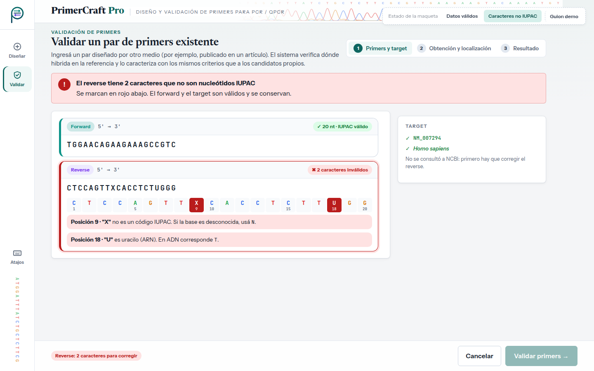

# Evaluación heurística — UI-4 · Validar primer existente

| | |
|---|---|
| **HU** | HU-03.1 · Ingreso y validación del primer (CU-03, Slice 1) |
| **Perfil** | [`user_profile.md`](../user_profile.md) |
| **Escenario de uso** | Escenario B — Validar un par diseñado por otro medio |
| **Maqueta** | [`hu-03-1_validar-primer.html`](../../mockups/hu-03-1_validar-primer.html) |
| **Herramienta IA** | Claude (generación) · Claude Code (iteración 2: JavaScript y panel) · Gemini (evaluación, en una conversación nueva) |

---

## Ciclo 1 — Generación del maquetado

### Prompt utilizado

```text
Actuá como diseñador/a de interfaces. Generá el maquetado en HTML de UNA pantalla de
"PrimerCraft Pro", una aplicación web para diseñar primers de PCR/qPCR.

CRITERIOS: <los mismos criterios que en UI-1 (ver criterios_generacion.md)>

USUARIO (perfil): <mismo perfil que en UI-1>

ESCENARIO: Laura recibió de un colega un par de primers publicado en un paper y quiere
saber si sirve para su target. Elige "Validar primer existente", pega forward y
reverse, el organismo y el identificador del target (NM_007294, Homo sapiens).

HISTORIA HU-03.1: Como investigador/a, quiero ingresar las secuencias de los primers que
diseñé externamente junto con el organismo y el identificador del target, para que el
sistema valide que los datos tienen un formato correcto antes de su verificación.
  1. Ingreso de datos → recibe forward, reverse, organismo e identificador.
  2. Validación del formato → verifica secuencias y campos y permite continuar.
  Además, CU-03 E1: la secuencia contiene caracteres fuera del alfabeto IUPAC.
```

> Los marcadores `<…>` remiten a textos ya transcriptos completos en el prompt de UI-1 y en el perfil; se abrevian para no repetirlos.

### Respuesta obtenida

HTML: [`../../mockups/hu-03-1_validar-primer.html`](../../mockups/hu-03-1_validar-primer.html) (v1, iteración 2).

### Vista previa (capturas de la versión actual)

**Datos válidos**


**Caracteres fuera de IUPAC (CU-03 E1)**



**Supuestos introducidos por la IA a revisar (iteración 1):**

- Editor de secuencia con regla por posición y bases coloreadas (A/C/G/T).
- Regla de limpieza "se ignoran espacios, saltos de línea y mayúsculas/minúsculas": no definida en el TP1.
- En CU-03 E1: posición exacta del carácter inválido y qué usar en su lugar. La v1 inicial tenía además botones "Reemplazar por N" / "Reemplazar por T"; **se quitaron antes de la evaluación** porque son una autocorrección que el TP1 no pide.
- Tabla de referencia del alfabeto IUPAC y panel "Qué se verifica".
- Atajo <kbd>Ctrl</kbd>+<kbd>Enter</kbd>.
- "Validar primers" lleva a UI-2 en el estado del flujo B (HU-03.2) y de ahí a UI-5, como indica el flujo de navegación del perfil.

### Iteración 2 del ciclo 1 (30/09) — Interacción con JavaScript y diseño de panel

Antes de correr la evaluación, el grupo cambió dos criterios de generación (ver [`criterios_generacion.md`](../criterios_generacion.md)) y pidió regenerar la maqueta con **Claude Code** sobre la misma base visual:

- **Tecnología:** HTML + CSS + **JavaScript** sin frameworks ni dependencias; el archivo se sigue abriendo con doble clic. El JavaScript va al final del archivo en dos bloques: `interaccion-nucleo` (igual en las cinco pantallas: datos de la corrida entre pantallas, avisos con "Deshacer", atajos de teclado, validaciones compartidas) e `interaccion-pantalla` (el comportamiento propio de esta pantalla). Sin JavaScript, la maqueta se ve como la versión estática.
- **Diseño de panel:** en escritorio la pantalla ocupa exactamente la ventana y no se desplaza; si una columna no entra, se desplaza solo esa columna. En tablet y teléfono se mantiene el desplazamiento normal.

**Qué cambió en esta pantalla:**

- Validación IUPAC mientras se escribe: la regla por posición marca cada carácter inválido y debajo aparece un mensaje por posición (CU-03 E1).
- Se ignoran espacios, saltos de línea y mayúsculas/minúsculas al escribir o pegar, como la pantalla ya indicaba.
- El identificador se valida igual que en UI-1. Los errores se listan en la barra inferior con un enlace a cada campo.
- "Cancelar" vacía las secuencias y se puede deshacer. Al volver desde UI-5 se conservan las secuencias y se explica qué revisar.
- Panel: primers a la izquierda con "Qué se verifica" debajo, en una fila (① ② ③); target y alfabeto IUPAC a la derecha.

**Supuestos nuevos a revisar:**

- Aviso de longitud fuera de 15–35 nt: no bloquea la validación.
- Los casos del botón "Guion demo" (por ejemplo, `NM_999999` → identificador inexistente) son convenciones de la simulación, no reglas del sistema.

**Qué descartó el grupo:**

- En esta iteración la IA volvió a agregar los botones "Reemplazar por N" / "Reemplazar por T". **Se quitaron otra vez**, por el mismo motivo que en la primera iteración: el TP1 (CU-03 E1) pide informar el error, no autocorregirlo.
- Pedido adicional del grupo: _"Qué se verifica … esta mal ordenado. ordenalo"_. Al pasar a panel, los tres puntos habían quedado desalineados; se ordenaron en una fila ① ② ③.

> **Al pedir la evaluación:** la pastilla punteada "Estado de la maqueta" y su botón "Guion demo" no son parte de la interfaz. El bloque `<style id="fuentes-embebidas">` (tipografías en base64, ~145 KB) se puede omitir al pegar el HTML.

---

## Ciclo 2 — Evaluación heurística por IA

### Prompt utilizado

```text
Asumí el rol de especialista en interfaz de usuario y usabilidad.
Evaluá esta pantalla de "PrimerCraft Pro" heurística por heurística según las 10
heurísticas de Nielsen, pensando en ESTE usuario y escenario (no uno genérico).
Ignorá la pastilla "Estado de la maqueta" y su botón "Guion demo": no son parte de la
interfaz. La pantalla tiene JavaScript: evaluá también su comportamiento, que está
descrito en los comentarios de los bloques <script>.

PERFIL: <pegar perfil §2>
ESCENARIO: <pegar Escenario B §3.2>
HISTORIA: <pegar HU-03.1 + CU-03 E1>

Para cada heurística: veredicto (CUMPLE / CUMPLE PARCIALMENTE / NO CUMPLE), por qué
(con referencia al elemento del HTML) y, si corresponde, hallazgo y sugerencia.
Numerá los hallazgos (H1, H2, …).
Respondé únicamente con un documento Markdown, sin texto antes ni después, para
guardarlo como archivo .md. Usá exactamente esta estructura:

# Evaluación heurística — <nombre de la pantalla>

## Resumen
| N.° | Heurística | Veredicto | Hallazgos |
(una fila por cada una de las 10 heurísticas; en Hallazgos, los H… o "—")

## 1. Visibilidad del estado del sistema
**Veredicto:** CUMPLE / CUMPLE PARCIALMENTE / NO CUMPLE
**Por qué:** … (con referencia al elemento concreto del HTML)
**Hallazgos:** H… (o "Ninguno")

(repetir la misma sección para las heurísticas 2 a 10)

## Hallazgos
| Hallazgo | Heurística | Severidad (0–4) | Elemento del HTML | Problema | Sugerencia |

HTML:
<pegar el contenido de hu-03-1_validar-primer.html, sin el bloque <style id="fuentes-embebidas">>
```

### Respuesta completa de la IA

Respuesta de **Gemini** en una conversación nueva (02/10/2026), pegada sin editar.

<details markdown="1">
<summary>Ver la respuesta completa</summary>

# Evaluación heurística — Validar primer existente (HU-03.1)

## Resumen

| N.° | Heurística | Veredicto | Hallazgos |
|---|---|---|---|
| 1 | Visibilidad del estado del sistema | CUMPLE PARCIALMENTE | H1, H2 |
| 2 | Coincidencia entre el sistema y el mundo real | CUMPLE | — |
| 3 | Control y libertad del usuario | CUMPLE PARCIALMENTE | H3 |
| 4 | Consistencia y estándares | CUMPLE PARCIALMENTE | H4 |
| 5 | Prevención de errores | CUMPLE PARCIALMENTE | H5, H6 |
| 6 | Reconocer antes que recordar | CUMPLE | — |
| 7 | Flexibilidad y eficiencia de uso | CUMPLE PARCIALMENTE | H7 |
| 8 | Estética y diseño minimalista | CUMPLE | — |
| 9 | Ayudar a los usuarios a reconocer, diagnosticar y recuperarse de errores | CUMPLE PARCIALMENTE | H8 |
| 10 | Ayuda y documentación | CUMPLE PARCIALMENTE | H9 |

---

## 1. Visibilidad del estado del sistema

**Veredicto:** CUMPLE PARCIALMENTE

**Por qué:** La interfaz muestra correctamente el paso activo mediante el componente `.stepper .cur` ("1. Secuencias y target"). Sin embargo, cuando se activa el estado de datos con errores (`#st2:checked`), la lista de errores globales (`.errsum`) que resume las fallas del formulario está oculta en pantallas de escritorio mediante CSS modal/responsive (`[data-pantalla=ui-4] .v1 .errsum { display: none }`), privando al usuario de un resumen consolidado de las fallas de entrada. Además, el botón de acción principal (`#btn-val`) cambia dinámicamente su texto a "Validando contra NCBI..." e incluye un spinner (`.spin`), pero el atributo `aria-disabled="true"` en la variante de error no impide la interacción por teclado o click de forma nativa al no ser un elemento `<button>` deshabilitado real o al faltar bloqueo de submit explícito en el formulario.

**Hallazgos:** H1, H2

---

## 2. Coincidencia entre el sistema y el mundo real

**Veredicto:** CUMPLE

**Por qué:** La pantalla utiliza terminología biológica precisa y natural para el perfil de biólogo molecular (como "Forward (5' → 3')", "Reverse (5' → 3')", "NCBI RefSeq / Gene ID", "Nomenclatura IUPAC", "Complementariedad 3'"). La representación visual de los pares de bases coloreados por nucleótido (`.ruler .A`, `.ruler .C`, `.ruler .G`, `.ruler .T`) y la separación clara entre las cadenas coinciden exactamente con la convención utilizada en herramientas estándar del dominio.

**Hallazgos:** Ninguno

---

## 3. Control y libertad del usuario

**Veredicto:** CUMPLE PARCIALMENTE

**Por qué:** La interfaz no ofrece un botón o acción directa dentro de los cuadros de edición para limpiar el texto ingresado (*Reset* / *Clear input*). Si un usuario pega por error una secuencia extensa o incorrecta en los campos `textarea`, debe seleccionarla y borrarla manualmente. Tampoco existe la posibilidad de restaurar valores por defecto o cancelar la operación de validación una vez disparada la petición asíncrona hacia NCBI.

**Hallazgos:** H3

---

## 4. Consistencia y estándares

**Veredicto:** CUMPLE PARCIALMENTE

**Por qué:** Existe una inconsistencia funcional en los controles de selección de organismo (`.chips` / `.chip`): mientras que la especie se selecciona mediante un grupo de chips interactivos (`#chips-org`), la variante para ingresar "Otro" renderiza un campo de texto adicional (`.org-otro`), pero este no comparte el mismo patrón de validación/estilo visual nativo que el campo de identificador de target (`#f-id`). Adicionalmente, se utiliza la clase CSS `.btn` en un enlace `<a>` para la acción "Validar primers" en la barra de acciones inferior, combinando comportamiento de navegación y ejecución de acción sin la semántica de formulario adecuada.

**Hallazgos:** H4

---

## 5. Prevención de errores

**Veredicto:** CUMPLE PARCIALMENTE

**Por qué:** Aunque la pantalla incluye sanitización automática al pegar secuencias (eliminando números, espacios y convirtiendo a mayúsculas mediante el comentario de script `e.value = e.value.toUpperCase().replace(/[^A-Z-]/g, '')`), el editor permite escribir libremente caracteres alfabéticos que no pertenecen al código IUPAC válido para bases de nucleótidos (por ejemplo, las letras 'Z', 'X', 'Q'). Aunque se resaltan en rojo con la clase `.ruler .x`, el sistema no previene la entrada en tiempo de tipeo ni advierte antes de presionar el botón de validación sobre qué letras específicas son inválidas de forma preventiva antes del blur/submit. Además, el campo Target admite formatos sin validar la coherencia previa con el organismo seleccionado.

**Hallazgos:** H5, H6

---

## 6. Reconocer antes que recordar

**Veredicto:** CUMPLE

**Por qué:** La interfaz expone de forma permanente en la columna lateral/inferior la tabla con la "Nomenclatura IUPAC para bases degeneradas" (`.iupac`), permitiendo al usuario verificar qué significa cada código (como R, Y, S, W, K, M, B, D, H, V, N) sin necesidad de recordarlo de memoria o acudir a otra pestaña. Además, los accesos directos de teclado estándar de la aplicación se detallan explícitamente y las instrucciones clave permanecen visibles.

**Hallazgos:** Ninguno

---

## 7. Flexibilidad y eficiencia de uso

**Veredicto:** CUMPLE PARCIALMENTE

**Por qué:** No se provee una funcionalidad para cargar archivos en formato FASTA/TXT o arrastrar y soltar (*drag & drop*), lo cual obliga al biólogo a copiar y pegar texto manualmente desde sus archivos locales. Para un usuario experto que valida múltiples pares de primers seguidos, la carga manual campo por campo reduce significativamente la eficiencia operativa.

**Hallazgos:** H7

---

## 8. Estética y diseño minimalista

**Veredicto:** CUMPLE

**Por qué:** La maquetación es clara, utiliza tipografía legible (`Instrument Sans` / `JetBrains Mono`), un esquema de color coherente para indicar la orientación forward (`--fwd: #0d9488`) y reverse (`--rev: #7c3aed`), y organiza la información en tarjetas sin recargar la pantalla con elementos innecesarios. Se oculta información secundaria de manera adecuada y la jerarquía visual dirige la atención a los campos clave.

**Hallazgos:** Ninguno

---

## 9. Ayudar a los usuarios a reconocer, diagnosticar y recuperarse de errores

**Veredicto:** CUMPLE PARCIALMENTE

**Por qué:** Cuando se ingresa un carácter no válido (Estado 2), el sistema señala la posición del error mediante `.ruler .x` y agrega el mensaje de error `.msg-err`. Sin embargo, la sugerencia de corrección automática (`.fix`) ofrece reemplazar o eliminar el carácter de forma estática, pero la acción no indica claramente a qué posición exacta de la secuencia se aplica la corrección cuando existen múltiples caracteres inválidos repetidos, lo que puede confundir al usuario al intentar corregir secuencias largas.

**Hallazgos:** H8

---

## 10. Ayuda y documentación

**Veredicto:** CUMPLE PARCIALMENTE

**Por qué:** No existe una sección de ayuda contextual o tooltip explícito que explique el formato esperado para el identificador del target en NCBI (por ejemplo, ejemplos visuales de RefSeq como `NM_001101` o Gene ID `7157`), obligando al usuario a asumir la sintaxis correcta.

**Hallazgos:** H9

---

## Hallazgos

| Hallazgo | Heurística | Severidad (0–4) | Elemento del HTML | Problema | Sugerencia |
|---|---|---|---|---|---|
| H1 | 1. Visibilidad del estado del sistema | 2 | `[data-pantalla=ui-4] .v1 .errsum` | El resumen global de errores `.errsum` se oculta mediante la regla CSS media query `@media (min-width: 1101px)` en la vista de escritorio, dejando al usuario sin una vista agrupada de todos los fallos del formulario. | Eliminar la regla `display: none` para `.errsum` en el CSS de panel de escritorio o ubicar el resumen dentro del área visible de la columna principal. |
| H2 | 1. Visibilidad del estado del sistema | 2 | `#btn-val` / `.btn[aria-disabled="true"]` | El botón de validación utiliza `aria-disabled="true"` en estado de error pero no deshabilita funcionalmente el elemento ni previene el evento click/submit a nivel JS, permitiendo intentar el envío con datos inválidos. | Reemplazar por `<button disabled>` o agregar un control de intercepción en el manejador de eventos `click`/`submit` que detenga la ejecución si el estado es inválido. |
| H3 | 3. Control y libertad del usuario | 1 | `.ed-b textarea` (`#f-fwd`, `#f-rev`) | Los campos de entrada de secuencia carecen de una opción/botón para limpiar rápidamente el contenido (*Clear field*). | Agregar un botón "Limpiar" o un icono con la acción de vaciar la secuencia en el encabezado `.ed-h` de cada editor. |
| H4 | 4. Consistencia y estándares | 2 | `#f-org-otro` / `.chip` | El campo para especificar "Otro organismo" aparece como un input desconectado visualmente de la botonera de chips `#chips-org`. | Integrar el input dentro del chip o convertir la selección de organismo en un combo de autocompletado consistente para cualquier especie. |
| H5 | 5. Prevención de errores | 3 | `.ed textarea` (`#f-fwd`, `#f-rev`) | Permite tipear y pegar cualquier letra del alfabeto; la validación IUPAC solo ocurre tras el evento de entrada, generando estados de error visibles en lugar de restringir/advertir la entrada de caracteres imposibles. | Filtrar o advertir en tiempo real mediante un indicador preventivo que bloquee caracteres no pertenecientes al alfabeto amino/nucleotídico o código IUPAC. |
| H6 | 5. Prevención de errores | 2 | `.input` (`#f-id`) | El campo de identificador de target no valida sintácticamente el formato esperado de NCBI en tiempo de tipeo (ej. prefijo `NM_`, `NC_` o numérico puro). | Añadir validación con expresión regular en línea para prefijos NCBI conocidos y mostrar sugerencia de formato en tiempo real. |
| H7 | 7. Flexibilidad y eficiencia de uso | 2 | `.ed` (`#f-fwd`, `#f-rev`) | La interfaz solo permite ingresar secuencias mediante tipeo/pegado manual en áreas de texto; no permite la carga de archivos `.fasta`, `.txt` o `.seq`. | Incorporar una zona de arrastrar y soltar (*drag & drop*) o un botón "Cargar archivo FASTA" que extraiga automáticamente las secuencias forward y reverse. |
| H8 | 9. Ayudar a los usuarios a reconocer, diagnosticar y recuperarse de errores | 2 | `.fix` | La caja de sugerencia de corrección `.fix` no especifica la posición del carácter incorrecto (p. ej., "Posición 12: carácter 'Z' no válido"). | Incluir el número de posición y contexto del nucleótido en la sugerencia de corrección de la alerta `.fix`. |
| H9 | 10. Ayuda y documentación | 1 | `.hint` (`#f-id`) | La ayuda del identificador del target es genérica y no provee un botón o tooltip con ejemplos de IDs válidos de NCBI RefSeq / Gene ID. | Añadir un botón o enlace de ayuda contextual con ejemplos cliqueables (ej. "Ej: NM_001101.5, 7157") que completen el campo como demostración. |

</details>

---

## Revisión crítica del grupo

Se verificó cada hallazgo contra el HTML y el JavaScript de la maqueta. De 9 hallazgos, 4 no coinciden con la maqueta (señalan un problema que el HTML no tiene) y 2 son parcialmente ciertos; no se acepta ninguno.

| Hallazgo | Heurística | Veredicto de la IA | Decisión | Justificación del grupo |
|---|---|---|---|---|
| H1 | 1. Visibilidad del estado del sistema | CUMPLE PARCIALMENTE · severidad 2 | Rechaza | **No coincide con la maqueta.** La regla CSS lo oculta solo en el estado **válido** (`.v1`). Con errores aparece el resumen con enlaces, y la barra inferior muestra "Reverse: 2 caracteres para corregir". |
| H2 | 1. Visibilidad del estado del sistema | CUMPLE PARCIALMENTE · severidad 2 | Rechaza | **No coincide con la maqueta.** El JavaScript intercepta el envío: si hay errores, muestra el resumen ("No se consultó a NCBI") y no avanza. |
| H3 | 3. Control y libertad del usuario | CUMPLE PARCIALMENTE · severidad 1 | Rechaza | Vaciar un campo de texto es una acción estándar (Ctrl+A, Supr), y existe "Cancelar". Impacto mínimo (severidad 1 según la propia IA). |
| H4 | 4. Consistencia y estándares | CUMPLE PARCIALMENTE · severidad 2 | Rechaza | **Parcialmente cierto.** Es una apreciación subjetiva y los selectores que cita (`#f-org-otro`, `#chips-org`) no existen. Es el mismo patrón que UI-1, así que hay consistencia entre pantallas. |
| H5 | 5. Prevención de errores | CUMPLE PARCIALMENTE · severidad 3 | Rechaza | CU-03 E1 pide **informar** el error, no impedirlo. La pantalla marca cada posición inválida mientras se escribe. Bloquear teclas o descartar caracteres al pegar alteraría la secuencia del paper sin avisar. |
| H6 | 5. Prevención de errores | CUMPLE PARCIALMENTE · severidad 2 | Rechaza | **No coincide con la maqueta.** Usa la misma validación que UI-1 (`PC.checkId`) y muestra "✓ Formato válido". |
| H7 | 7. Flexibilidad y eficiencia de uso | CUMPLE PARCIALMENTE · severidad 2 | Rechaza | HU-03.1 pide ingresar secuencias, no cargar archivos. Sería una función fuera de la HU. |
| H8 | 9. Ayudar a los usuarios a reconocer, diagnosticar y recuperarse de errores | CUMPLE PARCIALMENTE · severidad 2 | Rechaza | **No coincide con la maqueta.** Indica la posición y qué usar: "Posición 9 · "X" no es un código IUPAC. Si la base es desconocida, usá N." Además, la IA habla de botones "Reemplazar/Eliminar" que se quitaron antes de la evaluación. |
| H9 | 10. Ayuda y documentación | CUMPLE PARCIALMENTE · severidad 1 | Rechaza | **Parcialmente cierto.** El usuario tiene conocimiento alto y trabaja con NCBI a diario. El campo valida el formato y dice qué tipo de accession reconoció. |

**Criterio para decidir:** se acepta si el hallazgo afecta al perfil y al escenario concretos; se rechaza si supone un usuario genérico (por ejemplo, explicar qué es la Tm a alguien con conocimiento de dominio alto), si agrega funciones fuera de la HU o del alcance del SRS, o si contradice el TP1.

---

## Ciclos adicionales

> _Completar solo si, a partir de los hallazgos aceptados, se ajusta la pantalla: cambios pedidos (H…), prompt, archivo resultante (`…_v2.html`, sin pisar la v1) y reevaluación con la misma tabla._
