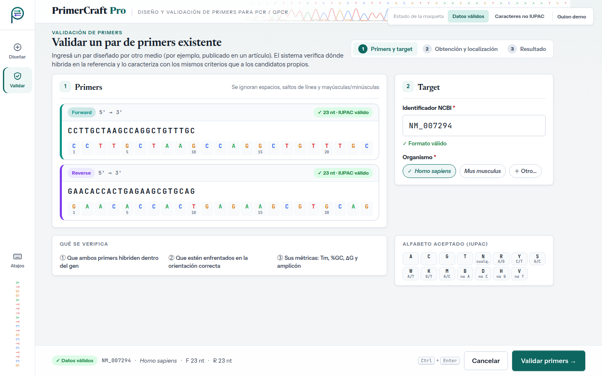
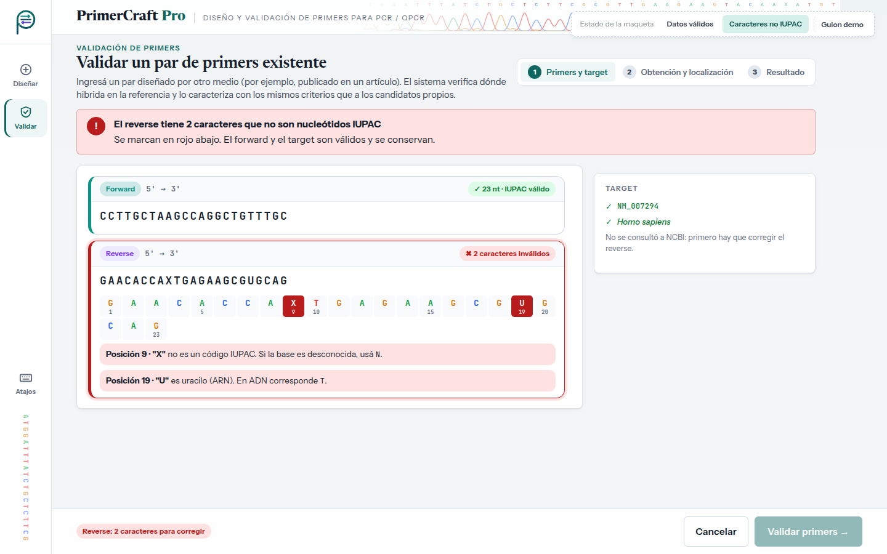

# Evaluación heurística — UI-4 · Validar primer existente

| | |
|---|---|
| **HU** | HU-03.1 · Ingreso y validación del primer (CU-03, Slice 1) |
| **Perfil** | [`perfil-investigador.md`](../user-profiles/perfil-investigador.md) |
| **Escenario de uso** | Escenario B — Validar un par diseñado por otro medio |
| **Maqueta** | [`hu-03-1_validar-primer.html`](../mockups/hu-03-1_validar-primer.html) |
| **Herramienta IA** | Claude (generación) · Claude Code (iteración 2: JavaScript y panel) · Gemini (evaluación, en una conversación nueva) |

---

## Ciclo 1 — Generación del maquetado

### Prompt utilizado

```text
Actuá como diseñador/a de interfaces. Generá el maquetado en HTML de UNA pantalla de
"PrimerCraft Pro", una aplicación web para diseñar primers de PCR/qPCR.

CRITERIOS: <los mismos criterios que en UI-1 (ver criterios-generacion.md)>

USUARIO (perfil): <mismo perfil que en UI-1>

ESCENARIO: Laura recibió de un colega un par de primers publicado en un paper y quiere
saber si sirve para su target. Elige "Validar primer existente", pega forward y
reverse, el organismo y el identificador del target (NM_007294, Homo sapiens).

HISTORIA HU-03.1: Como investigador/a, quiero ingresar las secuencias de los primers que
diseñé externamente junto con el organismo y el identificador del target, para que el
sistema valide que los datos tienen un formato correcto antes de su verificación.
  1. Ingreso de datos → recibe forward, reverse, organismo e identificador.
  2. Validación del formato → verifica secuencias y campos y permite continuar.
  Además, CU-03 E1: la secuencia contiene caracteres fuera del alfabeto IUPAC.
```

> Los marcadores `<…>` remiten a textos ya transcriptos completos en el prompt de UI-1 y en el perfil; se abrevian para no repetirlos.

### Respuesta obtenida

HTML: [`../mockups/hu-03-1_validar-primer.html`](../mockups/hu-03-1_validar-primer.html) (v1, iteración 2).

### Vista previa (capturas de la versión actual)

**Datos válidos**



**Caracteres fuera de IUPAC (CU-03 E1)**



**Supuestos introducidos por la IA a revisar (iteración 1):**

- Editor de secuencia con regla por posición y bases coloreadas (A/C/G/T).
- Regla de limpieza "se ignoran espacios, saltos de línea y mayúsculas/minúsculas": no definida en el TP1.
- En CU-03 E1: posición exacta del carácter inválido y qué usar en su lugar. La v1 inicial tenía además botones "Reemplazar por N" / "Reemplazar por T"; **se quitaron antes de la evaluación** porque son una autocorrección que el TP1 no pide.
- Tabla de referencia del alfabeto IUPAC y panel "Qué se verifica".
- Atajo <kbd>Ctrl</kbd>+<kbd>Enter</kbd>.
- "Validar primers" lleva a UI-2 en el estado del flujo B (HU-03.2) y de ahí a UI-5, como indica el flujo de navegación del perfil.

### Iteración 2 del ciclo 1 (30/09) — Interacción con JavaScript y diseño de panel

Antes de correr la evaluación, el grupo cambió dos criterios de generación (ver [`criterios-generacion.md`](../criterios-generacion.md)) y pidió regenerar la maqueta con **Claude Code** sobre la misma base visual:

- **Tecnología:** HTML + CSS + **JavaScript** sin frameworks ni dependencias; el archivo se sigue abriendo con doble clic. El JavaScript va al final del archivo en dos bloques: `interaccion-nucleo` (igual en las cinco pantallas: datos de la corrida entre pantallas, avisos con "Deshacer", atajos de teclado, validaciones compartidas) e `interaccion-pantalla` (el comportamiento propio de esta pantalla). Sin JavaScript, la maqueta se ve como la versión estática.
- **Diseño de panel:** en escritorio la pantalla ocupa exactamente la ventana y no se desplaza; si una columna no entra, se desplaza solo esa columna. En tablet y teléfono se mantiene el desplazamiento normal.

**Pedidos al asistente (texto literal del grupo):**

```text
el maquetado hacelo con html pero metele otro lenguaje para mejorar la experiencia del
usuario mas moderna
```

```text
hay widgets como el de [texto pegado del panel "Próximos pasos"] que tengo que deslizar
para verlos. la idea es que todo este en la misma vision, onda no tener que deslizar.
como un panel digamos
```

**Qué cambió en esta pantalla:**

- Validación IUPAC mientras se escribe: la regla por posición marca cada carácter inválido y debajo aparece un mensaje por posición (CU-03 E1).
- Se ignoran espacios, saltos de línea y mayúsculas/minúsculas al escribir o pegar, como la pantalla ya indicaba.
- El identificador se valida igual que en UI-1. Los errores se listan en la barra inferior con un enlace a cada campo.
- "Cancelar" vacía las secuencias y se puede deshacer. Al volver desde UI-5 se conservan las secuencias y se explica qué revisar.
- Panel: primers a la izquierda con "Qué se verifica" debajo, en una fila (① ② ③); target y alfabeto IUPAC a la derecha.

**Supuestos nuevos a revisar:**

- Aviso de longitud fuera de 15–35 nt: no bloquea la validación.
- Los casos del botón "Guion demo" (por ejemplo, `NM_999999` → identificador inexistente) son convenciones de la simulación, no reglas del sistema.

**Qué descartó el grupo:**

- En esta iteración la IA volvió a agregar los botones "Reemplazar por N" / "Reemplazar por T". **Se quitaron otra vez**, por el mismo motivo que en la primera iteración: el TP1 (CU-03 E1) pide informar el error, no autocorregirlo.
- Pedido adicional del grupo: _"Qué se verifica … esta mal ordenado. ordenalo"_. Al pasar a panel, los tres puntos habían quedado desalineados; se ordenaron en una fila ① ② ③.

> **Al pedir la evaluación:** la pastilla punteada "Estado de la maqueta" y su botón "Guion demo" no son parte de la interfaz. El bloque `<style id="fuentes-embebidas">` (tipografías en base64, ~145 KB) se puede omitir al pegar el HTML.

---

## Ciclo 2 — Evaluación heurística por IA

### Prompt utilizado

```text
Asumí el rol de especialista en interfaz de usuario y usabilidad.
Evaluá esta pantalla de "PrimerCraft Pro" heurística por heurística según las 10
heurísticas de Nielsen, pensando en ESTE usuario y escenario (no uno genérico).
Ignorá la pastilla "Estado de la maqueta" y su botón "Guion demo": no son parte de la
interfaz. La pantalla tiene JavaScript: evaluá también su comportamiento, que está
descrito en los comentarios de los bloques <script>.

PERFIL: <pegar perfil §2>
ESCENARIO: <pegar Escenario B §3.2>
HISTORIA: <pegar HU-03.1 + CU-03 E1>

Para cada heurística: veredicto (CUMPLE / CUMPLE PARCIALMENTE / NO CUMPLE), por qué
(con referencia al elemento del HTML) y, si corresponde, hallazgo y sugerencia.
Numerá los hallazgos (H1, H2, …).

HTML:
<pegar el contenido de hu-03-1_validar-primer.html, sin el bloque <style id="fuentes-embebidas">>
```

### Respuesta completa de la IA

> _Pendiente: pegar la respuesta completa de la IA, sin editar._

---

## Revisión crítica del grupo

> _Pendiente: completar después de la evaluación, con una fila por hallazgo (H1, H2, …)._

| Hallazgo | Heurística | Veredicto de la IA | Decisión | Justificación del grupo |
|---|---|---|---|---|
| H1 | | | Acepta / Rechaza | |
| H2 | | | | |
| H3 | | | | |

**Criterio para decidir:** se acepta si el hallazgo afecta al perfil y al escenario concretos; se rechaza si supone un usuario genérico (por ejemplo, explicar qué es la Tm a alguien con conocimiento de dominio alto), si agrega funciones fuera de la HU o del alcance del SRS, o si contradice el TP1.

---

## Ciclos adicionales

> _Completar solo si, a partir de los hallazgos aceptados, se ajusta la pantalla: cambios pedidos (H…), prompt, archivo resultante (`…_v2.html`, sin pisar la v1) y reevaluación con la misma tabla._
