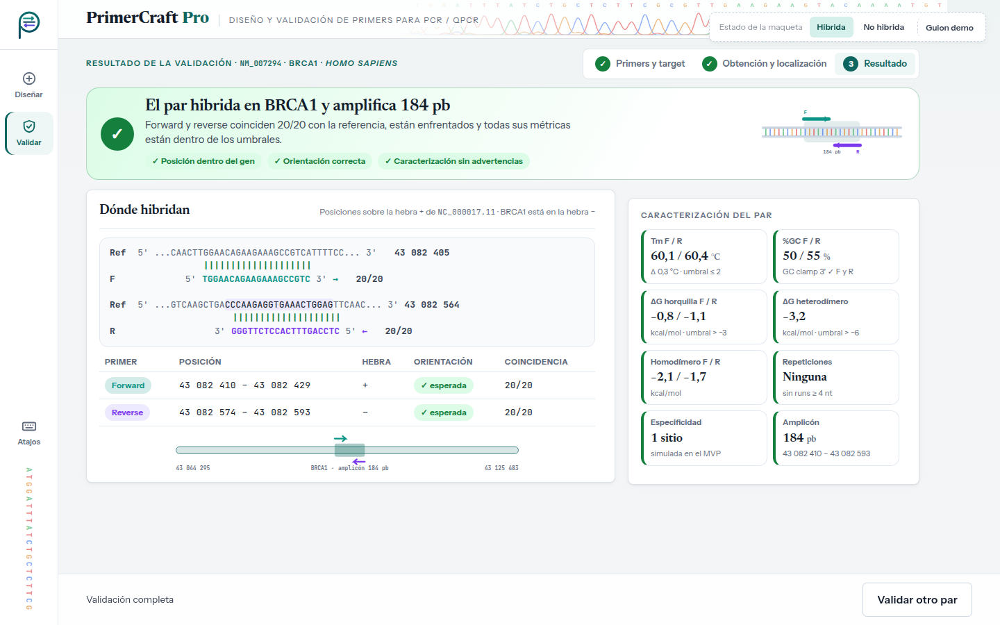
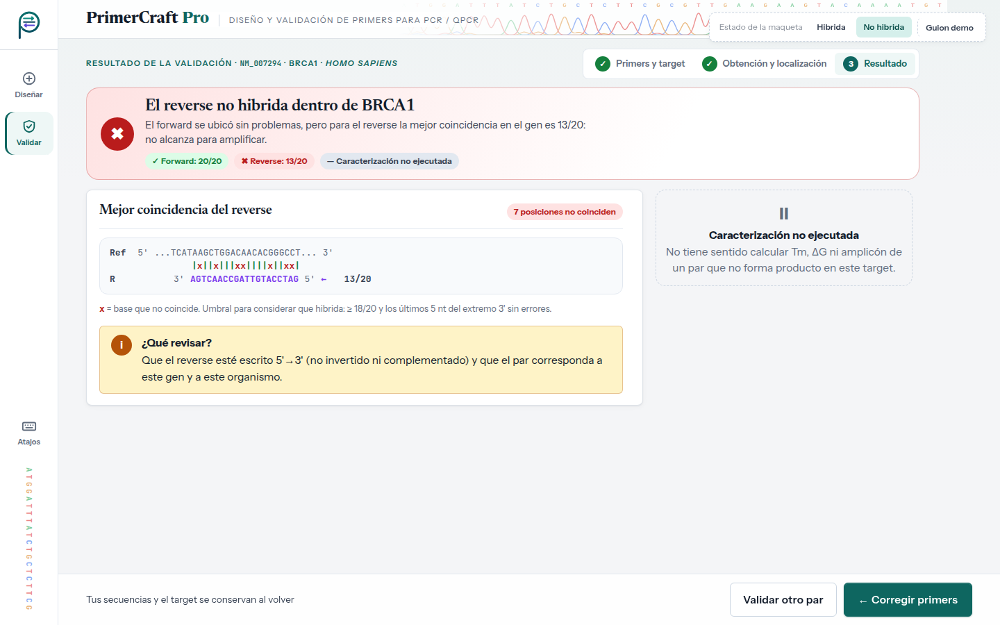

# Evaluación heurística — UI-5 · Resultado de validación

| | |
|---|---|
| **HU** | HU-03.3 · Verificación de hibridación y caracterización (CU-03, Slice 3) |
| **Perfil** | [`user_profile.md`](../user_profile.md) |
| **Escenario de uso** | Escenario B — Validar un par diseñado por otro medio |
| **Maqueta** | [`hu-03-3_resultado-validacion.html`](../../mockups/hu-03-3_resultado-validacion.html) |
| **Herramienta IA** | Claude (generación) · Claude Code (iteración 2: JavaScript y panel) · Gemini (evaluación, en una conversación nueva) |

---

## Ciclo 1 — Generación del maquetado

### Prompt utilizado

```text
Actuá como diseñador/a de interfaces. Generá el maquetado en HTML de UNA pantalla de
"PrimerCraft Pro", una aplicación web para diseñar primers de PCR/qPCR.

CRITERIOS: <los mismos criterios que en UI-1 (ver criterios_generacion.md)>

USUARIO (perfil): <mismo perfil que en UI-1>

ESCENARIO: el sistema ya obtuvo la referencia de NM_007294 y localizó BRCA1. Laura quiere
saber si el par que pegó hibrida en las posiciones y orientación esperadas y ver su
caracterización completa.

HISTORIA HU-03.3: Como investigador/a, quiero que el sistema verifique que mi par de
primers hibrida correctamente en la región objetivo y lo caracterice, para conocer si
es adecuado para amplificar el target.
  1. Localización de los primers → posiciones de forward y reverse.
  2. Verificación de posición y orientación → confirma que hibridan como se espera.
  3. Caracterización → métricas termodinámicas, estructuras secundarias, ΔG y amplicón.
  Además, CU-03 A1: el par no hibrida en la región esperada del gen.
```

> Los marcadores `<…>` remiten a textos ya transcriptos completos en el prompt de UI-1 y en el perfil; se abrevian para no repetirlos.

### Respuesta obtenida

HTML: [`../../mockups/hu-03-3_resultado-validacion.html`](../../mockups/hu-03-3_resultado-validacion.html) (v1, iteración 2).

### Vista previa (capturas de la versión actual)

**El par hibrida**



**No hibrida (CU-03 A1)**



**Supuestos introducidos por la IA a revisar (iteración 1):**

- Vista de alineamiento primer ↔ referencia con barras de coincidencia.
- Umbral de hibridación "≥ 18/20 y los últimos 5 nt del extremo 3' sin errores". **Lo inventó la IA; el TP1 no lo define.**
- En CU-03 A1 decide **no** ejecutar la caracterización. El TP1 no lo dice explícitamente, aunque HU-03.3 esc. 3 tiene como *Given* que el par hibrida, lo que lo respalda.
- Sugerencia "revisá que el reverse esté escrito 5'→3'".
- Mapa gráfico de la ubicación de los primers en el gen. Datos de ejemplo ilustrativos.

### Iteración 2 del ciclo 1 (30/09) — Interacción con JavaScript y diseño de panel

Antes de correr la evaluación, el grupo cambió dos criterios de generación (ver [`criterios_generacion.md`](../criterios_generacion.md)) y pidió regenerar la maqueta con **Claude Code** sobre la misma base visual:

- **Tecnología:** HTML + CSS + **JavaScript** sin frameworks ni dependencias; el archivo se sigue abriendo con doble clic. El JavaScript va al final del archivo en dos bloques: `interaccion-nucleo` (igual en las cinco pantallas: datos de la corrida entre pantallas, avisos con "Deshacer", atajos de teclado, validaciones compartidas) e `interaccion-pantalla` (el comportamiento propio de esta pantalla). Sin JavaScript, la maqueta se ve como la versión estática.
- **Diseño de panel:** en escritorio la pantalla ocupa exactamente la ventana y no se desplaza; si una columna no entra, se desplaza solo esa columna. En tablet y teléfono se mantiene el desplazamiento normal.

**Qué cambió en esta pantalla:**

- El resultado se calcula con las secuencias que llegan de UI-4: cada primer se busca sobre la región de referencia (aceptando códigos IUPAC) y se aplica el umbral de hibridación.
- "No hibrida" (CU-03 A1) se arma con la mejor coincidencia real: qué primer falla, cuántas bases coinciden y en qué posiciones.
- Si un primer coincide al tomarlo como complemento reverso, se avisa que parece estar en la orientación equivocada.
- Al pasar el mouse o el foco por una fila de la tabla, ese primer se resalta en el alineamiento.
- "Corregir primers" vuelve a UI-4 con las secuencias cargadas; "Validar otro par" conserva el target.

**Supuestos nuevos a revisar:**

- La búsqueda se hace sobre una región de referencia de ~200 pb (la del amplicón de ejemplo), no sobre el gen completo.
- El aviso de orientación equivocada.
- Los casos del botón "Guion demo" (por ejemplo, `NM_999999` → identificador inexistente) son convenciones de la simulación, no reglas del sistema.

> **Al pedir la evaluación:** la pastilla punteada "Estado de la maqueta" y su botón "Guion demo" no son parte de la interfaz. El bloque `<style id="fuentes-embebidas">` (tipografías en base64, ~145 KB) se puede omitir al pegar el HTML.

---

## Ciclo 2 — Evaluación heurística por IA

### Prompt utilizado

```text
Asumí el rol de especialista en interfaz de usuario y usabilidad.
Evaluá esta pantalla de "PrimerCraft Pro" heurística por heurística según las 10
heurísticas de Nielsen, pensando en ESTE usuario y escenario (no uno genérico).
Ignorá la pastilla "Estado de la maqueta" y su botón "Guion demo": no son parte de la
interfaz. La pantalla tiene JavaScript: evaluá también su comportamiento, que está
descrito en los comentarios de los bloques <script>.

PERFIL: <pegar perfil §2>
ESCENARIO: <pegar Escenario B §3.2>
HISTORIA: <pegar HU-03.3 + CU-03 A1>

Para cada heurística: veredicto (CUMPLE / CUMPLE PARCIALMENTE / NO CUMPLE), por qué
(con referencia al elemento del HTML) y, si corresponde, hallazgo y sugerencia.
Numerá los hallazgos (H1, H2, …).
Respondé únicamente con un documento Markdown, sin texto antes ni después, para
guardarlo como archivo .md. Usá exactamente esta estructura:

# Evaluación heurística — <nombre de la pantalla>

## Resumen
| N.° | Heurística | Veredicto | Hallazgos |
(una fila por cada una de las 10 heurísticas; en Hallazgos, los H… o "—")

## 1. Visibilidad del estado del sistema
**Veredicto:** CUMPLE / CUMPLE PARCIALMENTE / NO CUMPLE
**Por qué:** … (con referencia al elemento concreto del HTML)
**Hallazgos:** H… (o "Ninguno")

(repetir la misma sección para las heurísticas 2 a 10)

## Hallazgos
| Hallazgo | Heurística | Severidad (0–4) | Elemento del HTML | Problema | Sugerencia |

HTML:
<pegar el contenido de hu-03-3_resultado-validacion.html, sin el bloque <style id="fuentes-embebidas">>
```

### Respuesta completa de la IA

> _Pendiente: pegar la respuesta completa de la IA, sin editar._

---

## Revisión crítica del grupo

> _Pendiente: completar después de la evaluación, con una fila por hallazgo (H1, H2, …)._

| Hallazgo | Heurística | Veredicto de la IA | Decisión | Justificación del grupo |
|---|---|---|---|---|
| H1 | | | Acepta / Rechaza | |
| H2 | | | | |
| H3 | | | | |

**Criterio para decidir:** se acepta si el hallazgo afecta al perfil y al escenario concretos; se rechaza si supone un usuario genérico (por ejemplo, explicar qué es la Tm a alguien con conocimiento de dominio alto), si agrega funciones fuera de la HU o del alcance del SRS, o si contradice el TP1.

---

## Ciclos adicionales

> _Completar solo si, a partir de los hallazgos aceptados, se ajusta la pantalla: cambios pedidos (H…), prompt, archivo resultante (`…_v2.html`, sin pisar la v1) y reevaluación con la misma tabla._
