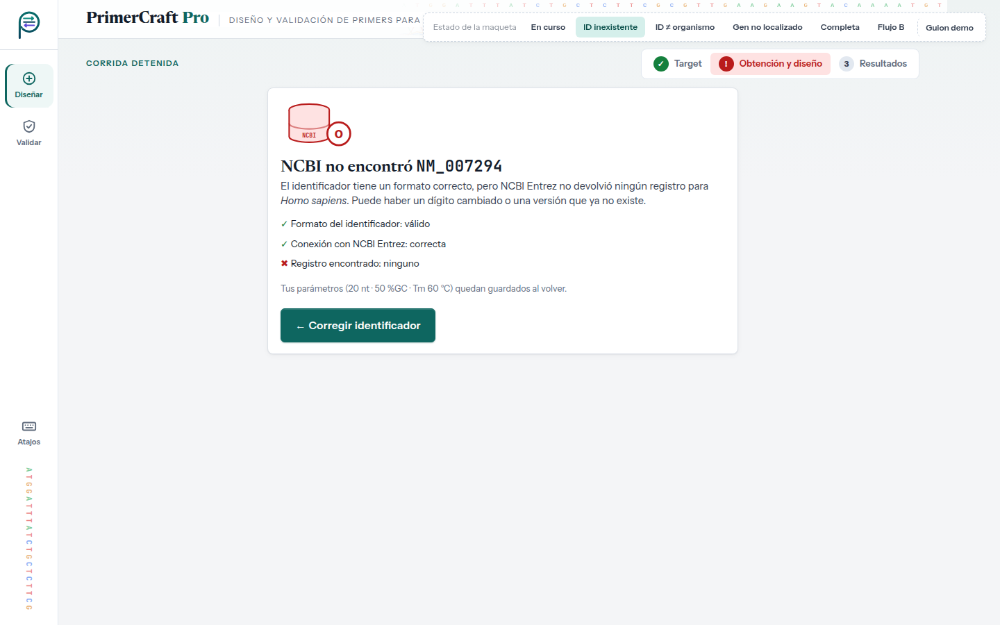
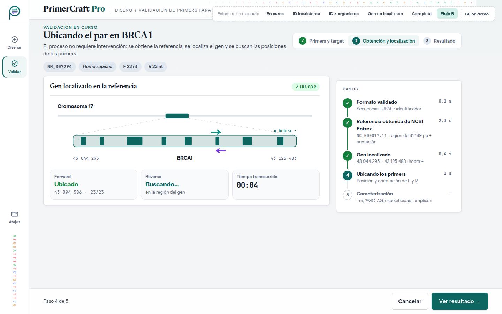

# Evaluación heurística — UI-2 · Progreso de la corrida

| | |
|---|---|
| **HU** | Pantalla compartida: HU-04 · Obtener la secuencia de referencia · HU-02.1 · Localización del gen · HU-02.2 · Generación automática de candidatos (sin pantalla propia: se ve como un paso) · HU-03.2 · Localización del gen en el flujo B |
| **Perfil** | [`perfil-investigador.md`](../user-profiles/perfil-investigador.md) |
| **Escenario de uso** | Escenario A — Diseñar primers para un gen (y Escenario B, paso intermedio de la validación) |
| **Maqueta** | [`hu-04_hu-02-1_progreso-corrida.html`](../mockups/hu-04_hu-02-1_progreso-corrida.html) |
| **Herramienta IA** | Claude (generación) · Claude Code (iteración 2: JavaScript y panel) · Gemini (evaluación, en una conversación nueva) |

---

## Ciclo 1 — Generación del maquetado

### Prompt utilizado

```text
Actuá como diseñador/a de interfaces. Generá el maquetado en HTML de UNA pantalla de
"PrimerCraft Pro", una aplicación web para diseñar primers de PCR/qPCR.

CRITERIOS: <los mismos criterios que en UI-1 (ver criterios-generacion.md)>

USUARIO (perfil): <mismo perfil que en UI-1>

ESCENARIO: Laura ya ingresó NM_007294 / Homo sapiens / 20 nt · 50 %GC · Tm 60 °C.
Ahora el sistema trabaja solo: obtiene la secuencia de NCBI Entrez, localiza el gen
(coordenadas y hebra), genera candidatos por ventana deslizante y los caracteriza.
Laura no tiene que descargar nada. Quiere saber en qué va el proceso.

HISTORIAS:
HU-04: Como investigador/a, quiero que el sistema consulte automáticamente NCBI Entrez
con el identificador y el organismo, para obtener la secuencia FASTA y la anotación.
  1. Consulta exitosa → obtiene FASTA y anotación.
  2. Identificador inexistente → notifica que no se encontró el target y pide verificar
     el identificador.
  3. Confirmación → informa que el target fue validado y la referencia quedó disponible.
  4. No requiere intervención manual → no hace falta descargar ni cargar el FASTA.
  Además, CU-04 E2: incompatibilidad entre identificador y organismo.
HU-02.1: el sistema localiza el gen en la anotación y obtiene coordenadas de inicio y fin
y la hebra. (Es automático: solo hay que MOSTRAR el resultado.)
HU-02.2 (generación de candidatos) es interna: mostrala solo como un paso del progreso.
Además, CU-02 A1: no se encuentra el gen en la anotación (localización fallida).
Esta pantalla se reutiliza en el flujo B (validar un primer existente, HU-03.2): mostrá
también ese estado, con los pasos "Primers y target / Obtención y localización / Resultado".
```

> Los marcadores `<…>` remiten a textos ya transcriptos completos en el prompt de UI-1 y en el perfil; se abrevian para no repetirlos.

### Respuesta obtenida

HTML: [`../mockups/hu-04_hu-02-1_progreso-corrida.html`](../mockups/hu-04_hu-02-1_progreso-corrida.html) (v1, iteración 2).

### Vista previa (capturas de la versión actual)

**En curso**


**ID inexistente (HU-04 esc. 2 · CU-04 E1)**



**ID y organismo no coinciden (CU-04 E2)**


**Completa (HU-04 esc. 3)**


**Gen no localizado en la anotación (CU-02 A1)**


**Validación en curso — flujo B (HU-03.2)**



> Al llegar desde UI-4 (botón "Validar primers") el enlace termina en `#flujo-b` y la maqueta muestra directamente este estado, sin JavaScript (selector `:target`).

**Supuestos introducidos por la IA a revisar (iteración 1):**

- Dibujo del cromosoma 17 y de BRCA1 con exones y una ventana deslizante animada. **Los exones son ilustrativos, no reales.**
- Contador de ventanas analizadas, pares que cumplen, tiempo transcurrido y tiempo por paso. El TP1 no dice que el avance sea medible.
- Botón "Cancelar corrida": no aparece en ningún CU.
- CU-04 E2 con acción directa "Continuar con *Homo sapiens*". Supone que NCBI devuelve el organismo del registro.
- CU-04 E1 con una lista de chequeo (formato ✓, conexión ✓, registro ✗) que distingue "no existe" de "NCBI no responde".
- CU-02 A1 (gen no localizado) con la explicación "suele pasar cuando se ingresa el accession de un cromosoma completo". Esa causa probable la propone la IA.
- Ilustraciones SVG en los estados de error (base de datos vacía, identificadores que no coinciden, lupa sobre la anotación).
- La referencia que se obtiene es genómica (`NC_000017.11`, región de 81 189 pb de BRCA1), no el ARNm `NM_007294`: así lo pide CU-04 ("genoma de referencia y anotación") y es lo que permite dar coordenadas y hebra. Las coordenadas de BRCA1 (chr17: 43 044 295 – 43 125 483, hebra −, GRCh38) son reales; el número de ventanas (81 170 = 81 189 − 20 + 1) sale de esa región.
- Estado del flujo B: tarjetas "Forward ubicado / Reverse buscando" y paso "Ubicando los primers".

### Iteración 2 del ciclo 1 (30/09) — Interacción con JavaScript y diseño de panel

Antes de correr la evaluación, el grupo cambió dos criterios de generación (ver [`criterios-generacion.md`](../criterios-generacion.md)) y pidió regenerar la maqueta con **Claude Code** sobre la misma base visual:

- **Tecnología:** HTML + CSS + **JavaScript** sin frameworks ni dependencias; el archivo se sigue abriendo con doble clic. El JavaScript va al final del archivo en dos bloques: `interaccion-nucleo` (igual en las cinco pantallas: datos de la corrida entre pantallas, avisos con "Deshacer", atajos de teclado, validaciones compartidas) e `interaccion-pantalla` (el comportamiento propio de esta pantalla). Sin JavaScript, la maqueta se ve como la versión estática.
- **Diseño de panel:** en escritorio la pantalla ocupa exactamente la ventana y no se desplaza; si una columna no entra, se desplaza solo esa columna. En tablet y teléfono se mantiene el desplazamiento normal.

**Pedidos al asistente (texto literal del grupo):**

```text
el maquetado hacelo con html pero metele otro lenguaje para mejorar la experiencia del
usuario mas moderna
```

```text
hay widgets como el de [texto pegado del panel "Próximos pasos"] que tengo que deslizar
para verlos. la idea es que todo este en la misma vision, onda no tener que deslizar.
como un panel digamos
```

**Qué cambió en esta pantalla:**

- La corrida se simula con los datos que llegan de UI-1: los pasos se completan de a uno, el contador de ventanas avanza hasta 81 170, aparecen las marcas de los pares que cumplen y corre el tiempo. El porcentaje también se ve en la pestaña del navegador.
- Según los datos ingresados, la corrida se desvía al estado que corresponde: identificador inexistente (CU-04 E1), identificador y organismo que no coinciden (CU-04 E2), gen no localizado (CU-02 A1) o corrida sin candidatos (CU-02 E1).
- "Cancelar corrida" pide confirmación en un diálogo y vuelve a UI-1 con los datos conservados. En CU-04 E2, "Continuar con *Homo sapiens*" retoma la corrida.
- El estado "Completa" muestra la cantidad de pares y el tiempo reales de la simulación.
- Flujo B (HU-03.2): la ubicación de F y R usa el mismo cálculo que UI-5, y "Ver resultado" se habilita al terminar.
- El estado "Gen no localizado" ahora aclara que también falló la localización interna sobre la secuencia, por coherencia con el escenario AF-1 de la Parte A.

**Supuestos nuevos a revisar:**

- Las duraciones de cada paso son ilustrativas.
- Los casos del botón "Guion demo" (por ejemplo, `NM_999999` → identificador inexistente) son convenciones de la simulación, no reglas del sistema.

> **Al pedir la evaluación:** la pastilla punteada "Estado de la maqueta" y su botón "Guion demo" no son parte de la interfaz. El bloque `<style id="fuentes-embebidas">` (tipografías en base64, ~145 KB) se puede omitir al pegar el HTML.

---

## Ciclo 2 — Evaluación heurística por IA

### Prompt utilizado

```text
Asumí el rol de especialista en interfaz de usuario y usabilidad.
Evaluá esta pantalla de "PrimerCraft Pro" heurística por heurística según las 10
heurísticas de Nielsen, pensando en ESTE usuario y escenario (no uno genérico).
Ignorá la pastilla "Estado de la maqueta" y su botón "Guion demo": no son parte de la
interfaz. La pantalla tiene JavaScript: evaluá también su comportamiento, que está
descrito en los comentarios de los bloques <script>.

PERFIL: <pegar perfil §2>
ESCENARIO: <pegar Escenario A §3.1>
HISTORIAS: <pegar HU-04, HU-02.1, CU-04 E1/E2 y CU-02 A1>

Para cada heurística: veredicto (CUMPLE / CUMPLE PARCIALMENTE / NO CUMPLE), por qué
(con referencia al elemento del HTML) y, si corresponde, hallazgo y sugerencia.
Numerá los hallazgos (H1, H2, …).

HTML:
<pegar el contenido de hu-04_hu-02-1_progreso-corrida.html, sin el bloque <style id="fuentes-embebidas">>
```

### Respuesta completa de la IA

> _Pendiente: pegar la respuesta completa de la IA, sin editar._

---

## Revisión crítica del grupo

> _Pendiente: completar después de la evaluación, con una fila por hallazgo (H1, H2, …)._

| Hallazgo | Heurística | Veredicto de la IA | Decisión | Justificación del grupo |
|---|---|---|---|---|
| H1 | | | Acepta / Rechaza | |
| H2 | | | | |
| H3 | | | | |

**Criterio para decidir:** se acepta si el hallazgo afecta al perfil y al escenario concretos; se rechaza si supone un usuario genérico (por ejemplo, explicar qué es la Tm a alguien con conocimiento de dominio alto), si agrega funciones fuera de la HU o del alcance del SRS, o si contradice el TP1.

---

## Ciclos adicionales

> _Completar solo si, a partir de los hallazgos aceptados, se ajusta la pantalla: cambios pedidos (H…), prompt, archivo resultante (`…_v2.html`, sin pisar la v1) y reevaluación con la misma tabla._
