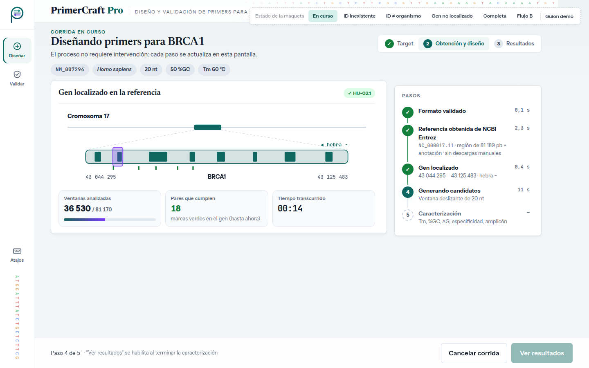
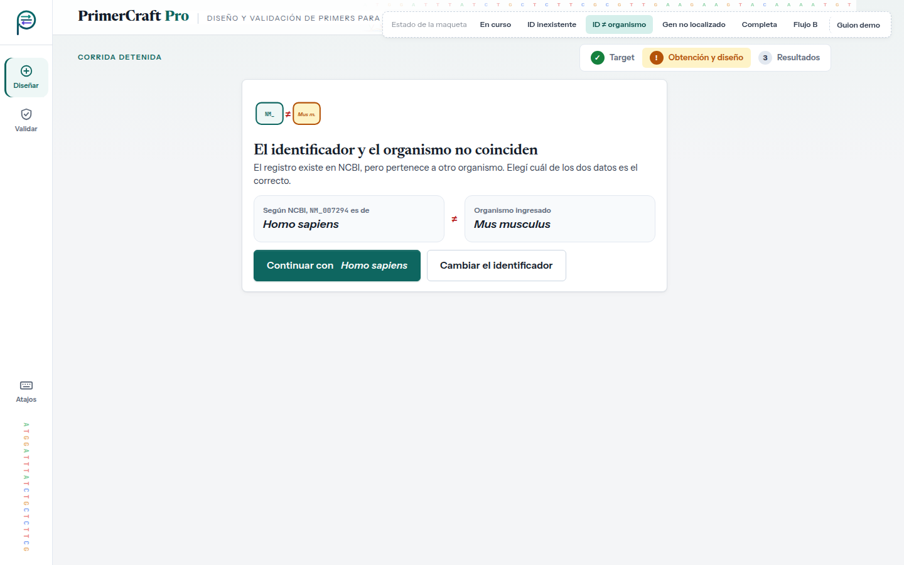
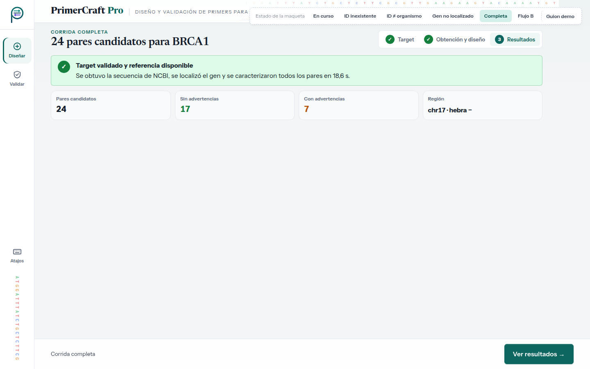
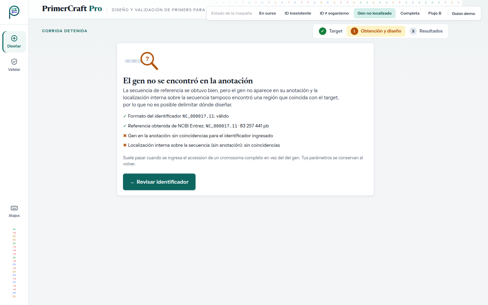
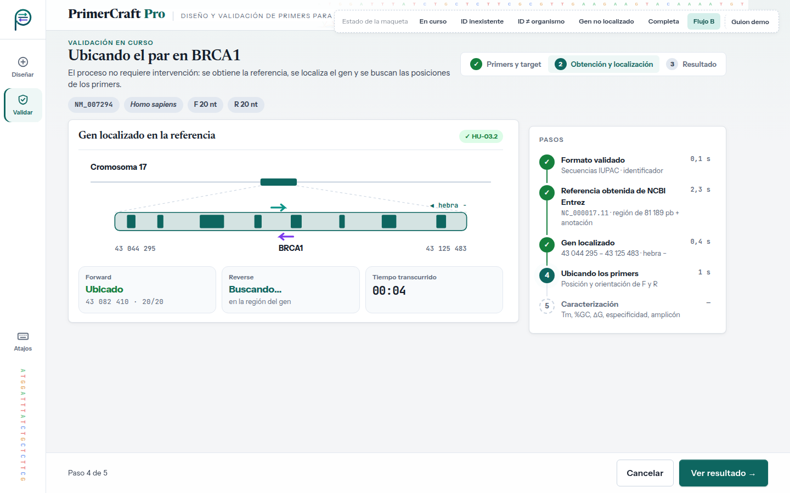

# Evaluación heurística — UI-2 · Progreso de la corrida

| | |
|---|---|
| **HU** | Pantalla compartida: HU-04 · Obtener la secuencia de referencia · HU-02.1 · Localización del gen · HU-02.2 · Generación automática de candidatos (sin pantalla propia: se ve como un paso) · HU-03.2 · Localización del gen en el flujo B |
| **Perfil** | [`user_profile.md`](../user_profile.md) |
| **Escenario de uso** | Escenario A — Diseñar primers para un gen (y Escenario B, paso intermedio de la validación) |
| **Maqueta** | [`hu-04_hu-02-1_progreso-corrida.html`](../../mockups/hu-04_hu-02-1_progreso-corrida.html) |
| **Herramienta IA** | Claude (generación) · Claude Code (iteración 2: JavaScript y panel) · Gemini (evaluación, en una conversación nueva) |

---

## Ciclo 1 — Generación del maquetado

### Prompt utilizado

```text
Actuá como diseñador/a de interfaces. Generá el maquetado en HTML de UNA pantalla de
"PrimerCraft Pro", una aplicación web para diseñar primers de PCR/qPCR.

CRITERIOS: <los mismos criterios que en UI-1 (ver criterios_generacion.md)>

USUARIO (perfil): <mismo perfil que en UI-1>

ESCENARIO: Laura ya ingresó NM_007294 / Homo sapiens / 20 nt · 50 %GC · Tm 60 °C.
Ahora el sistema trabaja solo: obtiene la secuencia de NCBI Entrez, localiza el gen
(coordenadas y hebra), genera candidatos por ventana deslizante y los caracteriza.
Laura no tiene que descargar nada. Quiere saber en qué va el proceso.

HISTORIAS:
HU-04: Como investigador/a, quiero que el sistema consulte automáticamente NCBI Entrez
con el identificador y el organismo, para obtener la secuencia FASTA y la anotación.
  1. Consulta exitosa → obtiene FASTA y anotación.
  2. Identificador inexistente → notifica que no se encontró el target y pide verificar
     el identificador.
  3. Confirmación → informa que el target fue validado y la referencia quedó disponible.
  4. No requiere intervención manual → no hace falta descargar ni cargar el FASTA.
  Además, CU-04 E2: incompatibilidad entre identificador y organismo.
HU-02.1: el sistema localiza el gen en la anotación y obtiene coordenadas de inicio y fin
y la hebra. (Es automático: solo hay que MOSTRAR el resultado.)
HU-02.2 (generación de candidatos) es interna: mostrala solo como un paso del progreso.
Además, CU-02 A1: no se encuentra el gen en la anotación (localización fallida).
Esta pantalla se reutiliza en el flujo B (validar un primer existente, HU-03.2): mostrá
también ese estado, con los pasos "Primers y target / Obtención y localización / Resultado".
```

> Este prompt se registra tal como se envió. En el SRS actual HU-04 tiene dos escenarios (consulta exitosa e identificador inexistente); los criterios 3 y 4 de este prompt ya no están en la HU, y "no se encuentra el gen en la anotación" es CU-02 E1, no A1.

> Los marcadores `<…>` remiten a textos ya transcriptos completos en el prompt de UI-1 y en el perfil; se abrevian para no repetirlos.

### Respuesta obtenida

HTML: [`../../mockups/hu-04_hu-02-1_progreso-corrida.html`](../../mockups/hu-04_hu-02-1_progreso-corrida.html) (v1, iteración 2).

### Vista previa (capturas de la versión actual)

**En curso**



**ID inexistente (HU-04 esc. 2 · CU-04 E1)**


**ID y organismo no coinciden (CU-04 E2)**



**Completa (HU-04 esc. 1 · HU-02.1)**



**Gen no localizado en la anotación (CU-02 E1)**



**Validación en curso — flujo B (HU-03.2)**



> Al llegar desde UI-4 (botón "Validar primers") el enlace termina en `#flujo-b` y la maqueta muestra directamente este estado, sin JavaScript (selector `:target`).

**Supuestos introducidos por la IA a revisar (iteración 1):**

- Dibujo del cromosoma 17 y de BRCA1 con exones y una ventana deslizante animada. **Los exones son ilustrativos, no reales.**
- Contador de ventanas analizadas, pares que cumplen, tiempo transcurrido y tiempo por paso. El TP1 no dice que el avance sea medible.
- Botón "Cancelar corrida": no aparece en ningún CU.
- CU-04 E2 con acción directa "Continuar con *Homo sapiens*". Supone que NCBI devuelve el organismo del registro.
- CU-04 E1 con una lista de chequeo (formato ✓, conexión ✓, registro ✗) que distingue "no existe" de "NCBI no responde".
- CU-02 E1 (gen no localizado) con la explicación "suele pasar cuando se ingresa el accession de un cromosoma completo". Esa causa probable la propone la IA.
- Ilustraciones SVG en los estados de error (base de datos vacía, identificadores que no coinciden, lupa sobre la anotación).
- La referencia que se obtiene es genómica (`NC_000017.11`, región de 81 189 pb de BRCA1), no el ARNm `NM_007294`: así lo pide CU-04 ("genoma de referencia y anotación") y es lo que permite dar coordenadas y hebra. Las coordenadas de BRCA1 (chr17: 43 044 295 – 43 125 483, hebra −, GRCh38) son reales; el número de ventanas (81 170 = 81 189 − 20 + 1) sale de esa región.
- Estado del flujo B: tarjetas "Forward ubicado / Reverse buscando" y paso "Ubicando los primers".

### Iteración 2 del ciclo 1 (30/09) — Interacción con JavaScript y diseño de panel

Antes de correr la evaluación, el grupo cambió dos criterios de generación (ver [`criterios_generacion.md`](../criterios_generacion.md)) y pidió regenerar la maqueta con **Claude Code** sobre la misma base visual:

- **Tecnología:** HTML + CSS + **JavaScript** sin frameworks ni dependencias; el archivo se sigue abriendo con doble clic. El JavaScript va al final del archivo en dos bloques: `interaccion-nucleo` (igual en las cinco pantallas: datos de la corrida entre pantallas, avisos con "Deshacer", atajos de teclado, validaciones compartidas) e `interaccion-pantalla` (el comportamiento propio de esta pantalla). Sin JavaScript, la maqueta se ve como la versión estática.
- **Diseño de panel:** en escritorio la pantalla ocupa exactamente la ventana y no se desplaza; si una columna no entra, se desplaza solo esa columna. En tablet y teléfono se mantiene el desplazamiento normal.

**Qué cambió en esta pantalla:**

- La corrida se simula con los datos que llegan de UI-1: los pasos se completan de a uno, el contador de ventanas avanza hasta 81 170, aparecen las marcas de los pares que cumplen y corre el tiempo. El porcentaje también se ve en la pestaña del navegador.
- Según los datos ingresados, la corrida se desvía al estado que corresponde: identificador inexistente (CU-04 E1), identificador y organismo que no coinciden (CU-04 E2), gen no localizado (CU-02 E1) o corrida sin candidatos (CU-02 E2).
- "Cancelar corrida" pide confirmación en un diálogo y vuelve a UI-1 con los datos conservados. En CU-04 E2, "Continuar con *Homo sapiens*" retoma la corrida.
- El estado "Completa" muestra la cantidad de pares y el tiempo reales de la simulación.
- Flujo B (HU-03.2): la ubicación de F y R usa el mismo cálculo que UI-5, y "Ver resultado" se habilita al terminar.
- El estado "Gen no localizado" ahora aclara que también falló la localización interna sobre la secuencia, por coherencia con el escenario AF-1 de la Parte A.

**Supuestos nuevos a revisar:**

- Las duraciones de cada paso son ilustrativas.
- Los casos del botón "Guion demo" (por ejemplo, `NM_999999` → identificador inexistente) son convenciones de la simulación, no reglas del sistema.

> **Al pedir la evaluación:** la pastilla punteada "Estado de la maqueta" y su botón "Guion demo" no son parte de la interfaz. El bloque `<style id="fuentes-embebidas">` (tipografías en base64, ~145 KB) se puede omitir al pegar el HTML.

---

## Ciclo 2 — Evaluación heurística por IA

### Prompt utilizado

```text
Asumí el rol de especialista en interfaz de usuario y usabilidad.
Evaluá esta pantalla de "PrimerCraft Pro" heurística por heurística según las 10
heurísticas de Nielsen, pensando en ESTE usuario y escenario (no uno genérico).
Ignorá la pastilla "Estado de la maqueta" y su botón "Guion demo": no son parte de la
interfaz. La pantalla tiene JavaScript: evaluá también su comportamiento, que está
descrito en los comentarios de los bloques <script>.

PERFIL: <pegar perfil §2>
ESCENARIO: <pegar Escenario A §3.1>
HISTORIAS: <pegar HU-04, CU-04 E1/E2, HU-02.1, CU-02 E1, HU-02.2 y HU-03.2 (flujo B)>

Para cada heurística: veredicto (CUMPLE / CUMPLE PARCIALMENTE / NO CUMPLE), por qué
(con referencia al elemento del HTML) y, si corresponde, hallazgo y sugerencia.
Numerá los hallazgos (H1, H2, …).
Respondé únicamente con un documento Markdown, sin texto antes ni después, para
guardarlo como archivo .md. Usá exactamente esta estructura:

# Evaluación heurística — <nombre de la pantalla>

## Resumen
| N.° | Heurística | Veredicto | Hallazgos |
(una fila por cada una de las 10 heurísticas; en Hallazgos, los H… o "—")

## 1. Visibilidad del estado del sistema
**Veredicto:** CUMPLE / CUMPLE PARCIALMENTE / NO CUMPLE
**Por qué:** … (con referencia al elemento concreto del HTML)
**Hallazgos:** H… (o "Ninguno")

(repetir la misma sección para las heurísticas 2 a 10)

## Hallazgos
| Hallazgo | Heurística | Severidad (0–4) | Elemento del HTML | Problema | Sugerencia |

HTML:
<pegar el contenido de hu-04_hu-02-1_progreso-corrida.html, sin el bloque <style id="fuentes-embebidas">>
```

### Respuesta completa de la IA

Respuesta de **Gemini** en una conversación nueva (02/10/2026), pegada sin editar. Las marcas como `[cite: 2]` son de la propia respuesta.

<details>
<summary>Ver la respuesta completa</summary>

# Evaluación heurística — Progreso de la corrida (HU-04, HU-02.1)

## Resumen

| N.° | Heurística | Veredicto | Hallazgos |
|---|---|---|---|
| 1 | Visibilidad del estado del sistema | CUMPLE PARCIALMENTE | H1, H2 |
| 2 | Coincidencia entre el sistema y el mundo real | CUMPLE | — |
| 3 | Control y libertad del usuario | CUMPLE PARCIALMENTE | H3, H4 |
| 4 | Consistencia y estándares | CUMPLE | — |
| 5 | Prevención de errores | CUMPLE | — |
| 6 | Reconocimiento antes que recuerdo | CUMPLE | — |
| 7 | Flexibilidad y eficiencia de uso | CUMPLE PARCIALMENTE | H5 |
| 8 | Estética y diseño minimalista | CUMPLE | — |
| 9 | Ayuda a los usuarios a reconocer, diagnosticar y recuperarse de errores | CUMPLE PARCIALMENTE | H6, H7 |
| 10 | Ayuda y documentación | CUMPLE PARCIALMENTE | H8 |

---

## 1. Visibilidad del estado del sistema

**Veredicto:** CUMPLE PARCIALMENTE  
**Por qué:** En el estado normal en curso (`v1`), la pantalla informa adecuadamente las etapas transcurridas y la etapa actual mediante una línea de tiempo (`ul.tl`), un indicador porcentual animado (`div.stat`) y una animación del locus genómico (`svg.locus .win`). Sin embargo, en los estados de error grave (como `v2` "ID inexistente", `v3` "Incompatibilidad de organismo" o `v5` "Gen no localizado"), la interfaz sustituye completamente el panel de progreso por una vista de error genérica (`div.big`) que elimina la línea de tiempo. Esto impide al biólogo visualizar en qué punto exacto de la tubería de análisis falló la consulta (por ejemplo, si la falla ocurrió al conectar con NCBI Entrez o durante el parsing de la anotación).  
**Hallazgos:** H1, H2

---

## 2. Coincidencia entre el sistema y el mundo real

**Veredicto:** CUMPLE  
**Por qué:** El lenguaje utilizado respeta rigurosamente el dominio de la biología molecular y la genómica. Términos como "NCBI Entrez", "FASTA", "Anotación", "Locus", "Exones", "Candidatos" y coordenadas genómicas son familiares y adecuados para un/a biólogo/a molecular[cite: 2]. La metáfora visual del locus con exones (`.exon`) e intrones alineada con una regla de pares de bases (`.axis`) refleja fielmente los esquemas genómicos habitualmente consultados por estos profesionales[cite: 2].  
**Hallazgos:** Ninguno

---

## 3. Control y libertad del usuario

**Veredicto:** CUMPLE PARCIALMENTE  
**Por qué:** Durante la ejecución en curso (`v1`), el botón de acción principal de la barra inferior dice "Cancelar corrida"[cite: 2]. Sin embargo, el script JavaScript adjunto no implementa un gestor de eventos (`addEventListener`) ni manejador para detener o abortar el proceso asincrónico (vía `AbortController` o actualización de estado). En las vistas de error (`v2`, `v3`, `v5`), aunque se ofrece el botón "Modificar datos de entrada", no se permite reintentar directamente la consulta en caso de fallos temporales de la API pública de NCBI sin tener que volver atrás y reescribir la información.  
**Hallazgos:** H3, H4

---

## 4. Consistencia y estándares

**Veredicto:** CUMPLE  
**Por qué:** La pantalla mantiene una coherencia estructural y visual completa con el resto de la aplicación, utilizando la misma barra de navegación lateral (`nav.rail`), el encabezado corporativo (`header.appbar`), el stepper de pasos y la barra de acciones inferior fija (`div.actionbar`)[cite: 2]. Los códigos de color para estados de éxito (verde `--ok`), advertencia/error (rojo `--err`) e información en curso (azul/verde primario `--primary`) son consistentes y estandarizados en todo el HTML y CSS[cite: 2].  
**Hallazgos:** Ninguno

---

## 5. Prevención de errores

**Veredicto:** CUMPLE  
**Por qué:** La pantalla es de carácter informativo/procesamiento y no expone formularios de edición directa que permitan la introducción de datos erróneos. La barra de acciones deshabilita de manera segura los botones de avance ("Ver candidatos" / "Ver resultados") con el atributo `disabled` y `aria-disabled="true"` mientras la corrida está en progreso (`v1`) o si esta ha terminado en error (`v2`, `v3`, `v5`), evitando la navegación a estados inconsistentes[cite: 2].  
**Hallazgos:** Ninguno

---

## 6. Reconocimiento antes que recuerdo

**Veredicto:** CUMPLE  
**Por qué:** En la parte superior de la pantalla se muestra explícitamente el bloque de contexto (`div.ctx`) con los parámetros ingresados en la etapa previa: identificador NCBI (`NM_007294`), organismo (`Homo sapiens`), Tm, %GC y longitud de oligos[cite: 2]. El investigador no necesita memorizar qué datos ingresó ni recurrir a notas externas para interpretar los resultados de la corrida en curso[cite: 2].  
**Hallazgos:** Ninguno

---

## 7. Flexibilidad y eficiencia de uso

**Veredicto:** CUMPLE PARCIALMENTE  
**Por qué:** No existe la opción de omitir o acelerar la animación de escaneo genómico si el usuario desea revisar únicamente el log textual de pasos. Además, cuando la corrida finaliza con éxito (`v4`), la interfaz requiere de forma obligatoria que el usuario haga clic en el botón inferior "Ver candidatos" para navegar hacia los resultados[cite: 2], en lugar de redirigir automáticamente o permitir un atajo de teclado explícito para la transición.  
**Hallazgos:** H5

---

## 8. Estética y diseño minimalista

**Veredicto:** CUMPLE  
**Por qué:** El diseño visual presenta una jerarquía clara, alta legibilidad y un uso equilibrado del espacio en blanco[cite: 2]. La información no esencial está omitida y los elementos decorativos (como las tramas de secuencias e ilustraciones SVG) no interfieren con la lectura de los indicadores de estado ni con las métricas principales[cite: 2].  
**Hallazgos:** Ninguno

---

## 9. Ayuda a los usuarios a reconocer, diagnosticar y recuperarse de errores

**Veredicto:** CUMPLE PARCIALMENTE  
**Por qué:** Ante errores de consulta NCBI (`v2` ID inexistente, `v3` Incompatibilidad ID vs. Organismo), los mensajes explican adecuadamente el problema y sugieren verificar los datos ingresados[cite: 2]. Sin embargo, en el escenario de fallo de localización del gen (`v5`), el mensaje de error "No se encontró ninguna coincidencia para el gen objetivo dentro de la anotación de referencia obtenida" es escueto y carece de orientación o acciones correctivas para el investigador (por ejemplo, sugerir la búsqueda manual por coordenadas genómicas o revisar alias del gen)[cite: 2]. Asimismo, el botón de retorno reenvía al usuario mediante `window.history.back()` en lugar de mantener el estado del formulario precompletado de manera explícita[cite: 2].  
**Hallazgos:** H6, H7

---

## 10. Ayuda y documentación

**Veredicto:** CUMPLE PARCIALMENTE  
**Por qué:** Si bien los nombres de los pasos de la corrida son claros ("Obteniendo secuencia NCBI Entrez", "Localizando gen objetivo", etc.)[cite: 2], no hay enlaces de ayuda, tooltips contextuales ni explicaciones breves sobre las limitaciones de tiempo asociadas a las cuotas de procesamiento y colas públicas de la API de NCBI Entrez o BLAST, un aspecto crítico de la frustración del perfil de usuario[cite: 2].  
**Hallazgos:** H8

---

## Hallazgos

| Hallazgo | Heurística | Severidad (0–4) | Elemento del HTML | Problema | Sugerencia |
|---|---|---|---|---|---|
| H1 | 1. Visibilidad del estado del sistema | 2 | `div.v2`, `div.v3`, `div.v5` | La vista de error reemplaza todo el panel de progreso (`.split`), ocultando la línea de tiempo (`ul.tl`). El usuario pierde el contexto de en qué etapa exacta falló la tubería[cite: 2]. | Mantener la estructura principal con la línea de tiempo visible, marcando con estado `.err` el paso específico donde ocurrió la falla y mostrando el mensaje descriptivo a un costado. |
| H2 | 1. Visibilidad del estado del sistema | 2 | `div.stat` | El porcentaje de avance (ej. "45%") y la barra de progreso no reflejan el tiempo ni el estado real de la solicitud asincrónica; son estáticos en el HTML o simulados[cite: 2]. | Vincular el porcentaje de la barra de progreso directamente con eventos de cambio de estado recibidos desde el servidor/API. |
| H3 | 3. Control y libertad del usuario | 2 | `button.btn-p` ("Cancelar corrida") | El botón de cancelación no posee implementación funcional en el bloque `<script>` para abortar peticiones HTTP en curso (`fetch` / `AbortController`)[cite: 2]. | Registrar el manejador de eventos `click` en el botón de cancelación que aborte la llamada API y retorne al usuario al estado de edición con un aviso informativo. |
| H4 | 3. Control y libertad del usuario | 2 | `div.v2`, `div.v3`, `div.v5` | Cuando la consulta falla por problemas en NCBI o red, no existe un botón "Reintentar" rápido sin abandonar la pantalla o perder los datos[cite: 2]. | Incluir un botón secundario "Reintentar consulta" junto a "Modificar datos de entrada" en las pantallas de error. |
| H5 | 7. Flexibilidad y eficiencia de uso | 1 | `div.v4 .actionbar` | Al completarse la corrida con éxito (`v4`), la pantalla requiere una acción manual obligatoria del usuario para ir a la vista de candidatos[cite: 2]. | Agregar una opción de redirección automática opcional al finalizar, o habilitar un atajo de teclado claro (ej. `Enter`) para avanzar. |
| H6 | 9. Reconocer, diagnosticar y recuperarse de errores | 3 | `div.v5 .big` | El mensaje de error por gen no localizado no explica probables causas del dominio (ej. anotación incompleta en NCBI, desajuste de símbolo genómico) ni sugiere alternativas de solución[cite: 2]. | Rediseñar el mensaje detallando que el identificador recuperado no contiene anotaciones CDS/mRNA claras para ese símbolo genómico e indicar cómo ajustar los parámetros. |
| H7 | 9. Reconocer, diagnosticar y recuperarse de errores | 2 | `a.btn[onclick="history.back()"]` | La navegación hacia atrás mediante el historial del navegador (`history.back()`) puede provocar la pérdida de parámetros ingresados si la página previa no los retuvo en el estado[cite: 2]. | Reemplazar `history.back()` por un enlace parametrizado explícito (ej. `hu-01-1_nueva-corrida-diseno.html?id=NM_007294`) que garantice la persistencia de los campos en el formulario. |
| H8 | 10. Ayuda y documentación | 1 | `div.tl` / `header.top` | No se advierte al usuario sobre posibles demoras derivadas de las restricciones y colas de espera del servidor público de NCBI Entrez[cite: 2]. | Incluir una nota contextual o tooltip informativo sobre los tiempos de espera promedio de NCBI cuando una etapa demore más de lo habitual. |

</details>

---

## Revisión crítica del grupo

> _Pendiente: completar después de la evaluación, con una fila por hallazgo (H1, H2, …)._

| Hallazgo | Heurística | Veredicto de la IA | Decisión | Justificación del grupo |
|---|---|---|---|---|
| H1 | | | Acepta / Rechaza | |
| H2 | | | | |
| H3 | | | | |

**Criterio para decidir:** se acepta si el hallazgo afecta al perfil y al escenario concretos; se rechaza si supone un usuario genérico (por ejemplo, explicar qué es la Tm a alguien con conocimiento de dominio alto), si agrega funciones fuera de la HU o del alcance del SRS, o si contradice el TP1.

---

## Ciclos adicionales

> _Completar solo si, a partir de los hallazgos aceptados, se ajusta la pantalla: cambios pedidos (H…), prompt, archivo resultante (`…_v2.html`, sin pisar la v1) y reevaluación con la misma tabla._
