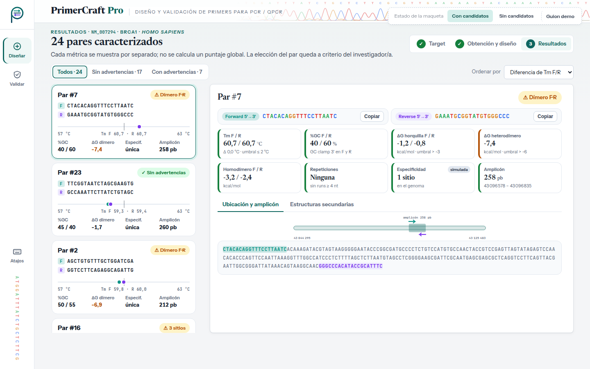
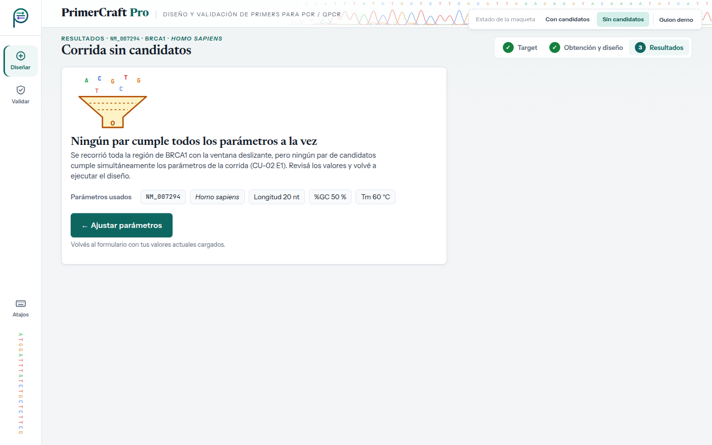

# Evaluación heurística — UI-3 · Resultados de candidatos

| | |
|---|---|
| **HU** | HU-05 · Caracterización de candidatos (CU-05, incluido desde CU-02) |
| **Perfil** | [`user_profile.md`](../user_profile.md) |
| **Escenario de uso** | Escenario A — Diseñar primers para un gen |
| **Maqueta** | [`hu-05_resultados-candidatos.html`](../../mockups/hu-05_resultados-candidatos.html) |
| **Herramienta IA** | Claude (generación) · Claude Code (iteración 2: JavaScript y panel) · Gemini (evaluación, en una conversación nueva) |

---

## Ciclo 1 — Generación del maquetado

### Prompt utilizado

```text
Actuá como diseñador/a de interfaces. Generá el maquetado en HTML de UNA pantalla de
"PrimerCraft Pro", una aplicación web para diseñar primers de PCR/qPCR.

CRITERIOS: <los mismos criterios que en UI-1 (ver criterios_generacion.md)>
Importante: el SRS deja FUERA de alcance el scoring/ranking automático. No inventes un
puntaje global: mostrá las métricas desglosadas y dejá que el usuario decida.

USUARIO (perfil): <mismo perfil que en UI-1>. Le molesta que las herramientas actuales
sean una "caja negra" que solo exponen un número final.

ESCENARIO: la corrida de NM_007294 (BRCA1, Homo sapiens) terminó. Laura quiere ver
los pares candidatos con sus métricas y abrir el detalle de uno para ver el amplicón.

HISTORIA HU-05: Como investigador/a, quiero que el sistema caracterice los pares
candidatos según sus propiedades termodinámicas, especificidad y estructuras
secundarias, así como el amplicón esperado, para disponer de candidatos adecuados.
  1. Métricas: Tm real, %GC, GC clamp y penalización por repeticiones de cada primer.
  2. Estructuras secundarias: horquillas, homodímeros y heterodímero F/R con su ΔG.
  3. Amplicón: posición y longitud.
  4. Conjunto final de pares caracterizados.
  Además, CU-02 E1: ningún candidato cumple todos los parámetros.
  La especificidad (BLAST) en el MVP es simulada (mock).
```

> Este prompt se registra tal como se envió. En el SRS actual "ningún candidato cumple todos los parámetros" es CU-02 E2, no E1.

> Los marcadores `<…>` remiten a textos ya transcriptos completos en el prompt de UI-1 y en el perfil; se abrevian para no repetirlos.

### Respuesta obtenida

HTML: [`../../mockups/hu-05_resultados-candidatos.html`](../../mockups/hu-05_resultados-candidatos.html) (v1, iteración 2).

### Vista previa (capturas de la versión actual)

**Con candidatos**



**Sin candidatos (CU-02 E2)**



**Supuestos introducidos por la IA a revisar (iteración 1):**

- Umbrales de semáforo (ΔG horquilla > −3, dímero > −6 kcal/mol, ΔTm ≤ 2 °C, repeticiones ≥ 4 nt). **No están en el SRS.** Son valores habituales en la bibliografía, pero el grupo debe decidir si los adopta y documentarlos.
- Gráfico de "pesas" (dumbbell) con la Tm de F y R sobre la escala 57–63 °C y el objetivo marcado.
- Filtros (todos / sin advertencias / con advertencias), opciones de orden y botón "Copiar" de cada secuencia. Copiar no es exportar, pero tampoco está en el TP1.
- Vista del heterodímero F·R con los enlaces marcados.
- En CU-02 E2: la v1 inicial tenía un embudo con cuántas ventanas descartó cada parámetro y una sugerencia de ajuste. **Se quitó antes de la evaluación** porque es una función de diagnóstico que el TP1 no pide; quedaron el mensaje, los parámetros usados y el botón "Ajustar parámetros".
- La pantalla evita a propósito cualquier puntaje global o "mejor par" (fuera de alcance, SRS §2.6).
- Secuencias y métricas de ejemplo **ilustrativas** (no calculadas); el amplicón mostrado sí mide 184 pb.
- Ilustraciones SVG (cromatograma del encabezado, ícono de filtro sin resultados, par hibridado) embebidas en el HTML.

### Iteración 2 del ciclo 1 (30/09) — Interacción con JavaScript y diseño de panel

Antes de correr la evaluación, el grupo cambió dos criterios de generación (ver [`criterios_generacion.md`](../criterios_generacion.md)) y pidió regenerar la maqueta con **Claude Code** sobre la misma base visual:

- **Tecnología:** HTML + CSS + **JavaScript** sin frameworks ni dependencias; el archivo se sigue abriendo con doble clic. El JavaScript va al final del archivo en dos bloques: `interaccion-nucleo` (igual en las cinco pantallas: datos de la corrida entre pantallas, avisos con "Deshacer", atajos de teclado, validaciones compartidas) e `interaccion-pantalla` (el comportamiento propio de esta pantalla). Sin JavaScript, la maqueta se ve como la versión estática.
- **Diseño de panel:** en escritorio la pantalla ocupa exactamente la ventana y no se desplaza; si una columna no entra, se desplaza solo esa columna. En tablet y teléfono se mantiene el desplazamiento normal.

**Qué cambió en esta pantalla:**

- La lista se arma desde datos: los 4 pares de la versión estática más 20 generados de forma reproducible (mismo resultado en cada apertura). Los contadores de los filtros son reales (24 · 17 · 7).
- Filtros y orden funcionan; "Ver más" agrega de a 6 pares.
- Se elige un par con el mouse o con las flechas ↑ ↓ (atajos <kbd>j</kbd> / <kbd>k</kbd>). El detalle se actualiza con sus secuencias, métricas, umbrales, ubicación y amplicón.
- Las pestañas funcionan: "Estructuras secundarias" dibuja el heterodímero calculado a partir de las secuencias y muestra horquillas y homodímeros.
- "Copiar" deja la secuencia en el portapapeles y lo confirma con un aviso (atajo <kbd>c</kbd>).
- Panel: la lista tiene desplazamiento propio; en el detalle, forward y reverse van lado a lado.

**Supuestos nuevos a revisar:**

- Los 20 pares agregados y sus métricas son datos de ejemplo (GC entre 40 % y 60 %). El dibujo del heterodímero se calcula, pero el valor de ΔG es un dato de ejemplo.
- Por defecto se muestra primero el par con menor diferencia de Tm (es el primer criterio de orden).
- Los casos del botón "Guion demo" (por ejemplo, `NM_999999` → identificador inexistente) son convenciones de la simulación, no reglas del sistema.

> **Al pedir la evaluación:** la pastilla punteada "Estado de la maqueta" y su botón "Guion demo" no son parte de la interfaz. El bloque `<style id="fuentes-embebidas">` (tipografías en base64, ~145 KB) se puede omitir al pegar el HTML.

---

## Ciclo 2 — Evaluación heurística por IA

### Prompt utilizado

```text
Asumí el rol de especialista en interfaz de usuario y usabilidad.
Evaluá esta pantalla de "PrimerCraft Pro" heurística por heurística según las 10
heurísticas de Nielsen, pensando en ESTE usuario y escenario (no uno genérico).
Ignorá la pastilla "Estado de la maqueta" y su botón "Guion demo": no son parte de la
interfaz. La pantalla tiene JavaScript: evaluá también su comportamiento, que está
descrito en los comentarios de los bloques <script>.

PERFIL: <pegar perfil §2>
ESCENARIO: <pegar Escenario A §3.1>
HISTORIA: <pegar HU-05 + CU-02 E2>

Para cada heurística: veredicto (CUMPLE / CUMPLE PARCIALMENTE / NO CUMPLE), por qué
(con referencia al elemento del HTML) y, si corresponde, hallazgo y sugerencia.
Numerá los hallazgos (H1, H2, …).
Respondé únicamente con un documento Markdown, sin texto antes ni después, para
guardarlo como archivo .md. Usá exactamente esta estructura:

# Evaluación heurística — <nombre de la pantalla>

## Resumen
| N.° | Heurística | Veredicto | Hallazgos |
(una fila por cada una de las 10 heurísticas; en Hallazgos, los H… o "—")

## 1. Visibilidad del estado del sistema
**Veredicto:** CUMPLE / CUMPLE PARCIALMENTE / NO CUMPLE
**Por qué:** … (con referencia al elemento concreto del HTML)
**Hallazgos:** H… (o "Ninguno")

(repetir la misma sección para las heurísticas 2 a 10)

## Hallazgos
| Hallazgo | Heurística | Severidad (0–4) | Elemento del HTML | Problema | Sugerencia |

HTML:
<pegar el contenido de hu-05_resultados-candidatos.html, sin el bloque <style id="fuentes-embebidas">>
```

### Respuesta completa de la IA

Respuesta de **Gemini** en una conversación nueva (02/10/2026), pegada sin editar.

<details markdown="1">
<summary>Ver la respuesta completa</summary>

# Evaluación heurística — Resultados de candidatos (HU-05)

## Resumen
| N.° | Heurística | Veredicto | Hallazgos |
|---|---|---|---|
| 1 | Visibilidad del estado del sistema | CUMPLE PARCIALMENTE | H1, H2 |
| 2 | Coincidencia entre el sistema y el mundo real | CUMPLE | — |
| 3 | Control y libertad del usuario | CUMPLE PARCIALMENTE | H3, H4 |
| 4 | Consistencia y estándares | CUMPLE PARCIALMENTE | H5, H6 |
| 5 | Prevención de errores | CUMPLE | — |
| 6 | Reconocer antes que recordar | CUMPLE | — |
| 7 | Flexibilidad y eficiencia de uso | CUMPLE PARCIALMENTE | H7 |
| 8 | Estética y diseño minimalista | CUMPLE | — |
| 9 | Ayudar a los usuarios a reconocer, diagnosticar y recuperarse de errores | NO CUMPLE | H8, H9 |
| 10 | Ayuda y documentación | CUMPLE PARCIALMENTE | H10 |

---

## 1. Visibilidad del estado del sistema
**Veredicto:** CUMPLE PARCIALMENTE  
**Por qué:** En la vista principal (`.v1`), el sistema indica claramente qué par candidato está seleccionado (`.pair.sel`) y actualiza el panel de detalle (`.det-h`, `.metrics`) de forma inmediata. Sin embargo, en la lista de pares candidatos (`.list .pair`), no se muestra explícitamente el número total de candidatos generados ni la posición del par seleccionado dentro del total (p. ej., "Mostrando 1 de 24 candidatos"). Además, en la vista sin candidatos (`#st2` / `.v2`), se muestra una llamada informativa (`.callout`), pero no se explicita visualmente qué fase o criterio del filtro descartó la totalidad de los pares.  
**Hallazgos:** H1, H2

---

## 2. Coincidencia entre el sistema y el mundo real
**Veredicto:** CUMPLE  
**Por qué:** El lenguaje utilizado respeta plenamente el dominio del usuario (Biólogo/a molecular con alto conocimiento del dominio). Términos como Tm, %GC, GC clamp, ΔG de horquillas y heterodímeros, hebra Forward/Reverse, amplicón y coordenadas de secuencia están expresados con rigor técnico en los bloques `.metrics`, `.dimer` y `.amp`. La representación visual del amplicón y el "dumbbell" de Tm (`.db`) coinciden con modelos mentales habituales en biología molecular.  
**Hallazgos:** Ninguno

---

## 3. Control y libertad del usuario
**Veredicto:** CUMPLE PARCIALMENTE  
**Por qué:** El usuario puede seleccionar libremente cualquier par de la lista (`.pair`), alternar entre las pestañas del detalle (`.tabs span`) y copiar secuencias al portapapeles mediante el botón `.copy`. No obstante, la interfaz no ofrece un mecanismo para reordenar o filtrar los pares candidatos (por ejemplo, ordenar por ΔG, Tm o longitud del amplicón). En la barra de acción inferior (`.actionbar`), si el usuario desea modificar los parámetros de diseño iniciales tras ver los resultados, no dispone de un botón directo de "Ajustar parámetros" o "Volver a diseñar", obligándolo a recurrir a la navegación general del riel (`.rail a`).  
**Hallazgos:** H3, H4

---

## 4. Consistencia y estándares
**Veredicto:** CUMPLE PARCIALMENTE  
**Por qué:** La paleta visual y la estructura general son consistentes con la guía del sistema (`.fwd` en tono verde/azulado, `.rev` en violeta). Sin embargo, se observa una inconsistencia funcional en la interacción con las pestañas de detalle (`.tabs span`): en el marcado HTML estático no se utilizan roles accesibles de ARIA (`role="tablist"`, `role="tab"`, `aria-selected`), y el comportamiento script asociado solo maneja estilos de activación visual sin asegurar la gestión de foco por teclado estándar. Además, la nomenclatura de alertas en métricas usa clases heterogéneas (`.m.ok`, `.m.w`, `.m.e`) respecto al estándar global de insignias (`.b-ok`, `.b-warn`, `.b-err`).  
**Hallazgos:** H5, H6

---

## 5. Prevención de errores
**Veredicto:** CUMPLE  
**Por qué:** Los valores fuera de rango recomendado o que presentan riesgos termodinámicos (como un ΔG muy negativo o una diferencia de Tm elevada) se destacan visualmente con bordes y colores de advertencia (`.m.w`, `.fp .w b`). La copia de secuencias mediante `.copy` previene errores manuales de transcripción o selección de texto al pasar los primers a un pedido de síntesis o a una planilla.  
**Hallazgos:** Ninguno

---

## 6. Reconocer antes que recordar
**Veredicto:** CUMPLE  
**Por qué:** El desglose completo de métricas por par en `.metrics` (Tm, %GC, GC clamp, ΔG horquilla, ΔG homodímero, ΔG heterodímero) evita que el usuario tenga que calcular de memoria o deducir por qué un par recibió determinado puntaje. La alineación del heterodímero (`.dimer`) y la simulación del amplicón (`.amp`) muestran exactamente la secuencia y los sitios de unión con resaltado sintáctico de bases (`.seq .A`, `.C`, `.G`, `.T`), satisfaciendo la necesidad del usuario de ver las métricas desglosadas para confiar en el resultado.  
**Hallazgos:** Ninguno

---

## 7. Flexibilidad y eficiencia de uso
**Veredicto:** CUMPLE PARCIALMENTE  
**Por qué:** La función de copiar secuencia en un clic (`.copy`) acelera el flujo de trabajo de la mesada/oficina. Sin embargo, falta una opción de exportación masiva (por ejemplo, exportar la lista de candidatos o el reporte del par seleccionado a CSV, FASTA o PDF) para alimentar el registro de trabajo del laboratorio sin requerir copiar par por par.  
**Hallazgos:** H7

---

## 8. Estética y diseño minimalista
**Veredicto:** CUMPLE  
**Por qué:** La interfaz aplica una jerarquía visual limpia mediante la tipografía (*Newsreader* y *Instrument Sans* con *JetBrains Mono* para código genético) y tarjetas estructuradas (`.card`, `.split`, `.res`). La información técnica densa está organizada en columnas de resumen y detalle sin sobrecargar la pantalla ni incluir elementos decorativos irrelevantes.  
**Hallazgos:** Ninguno

---

## 9. Ayudar a los usuarios a reconocer, diagnosticar y recuperarse de errores
**Veredicto:** NO CUMPLE  
**Por qué:** Cuando el sistema no genera ningún candidato (`#st2` / `.v2` - CU-02 E2), la pantalla muestra un aviso genérico de que no se encontraron pares que cumplan los parámetros, pero no proporciona un diagnóstico claro sobre qué parámetro fue el más restrictivo (p. ej., Tm, %GC o heterodímeros) ni ofrece acciones directas / atajos para relajar dicho parámetro y reintentar la búsqueda sin perder los datos ingresados.  
**Hallazgos:** H8, H9

---

## 10. Ayuda y documentación
**Veredicto:** CUMPLE PARCIALMENTE  
**Por qué:** Las métricas cuentan con etiquetas claras, pero carecen de contextualización o valor umbral de referencia explicito en la interfaz (por ejemplo, un *tooltip* o texto explicativo sobre el rango óptimo de ΔG aceptable para prevenir estructuras secundarias en qPCR). Si bien el usuario posee alto conocimiento del dominio, disponer del valor límite de referencia directo reduce la carga cognitiva durante la validación.  
**Hallazgos:** H10

---

## Hallazgos

| Hallazgo | Heurística | Severidad (0–4) | Elemento del HTML | Problema | Sugerencia |
|---|---|---|---|---|---|
| H1 | 1. Visibilidad del estado del sistema | 2 | `.toolbar`, `.list` | No se indica la cantidad total de pares candidatos generados ni el total filtrado/mostrado en la cabecera del listado. | Agregar un contador visible en la barra de herramientas (ej. "24 candidatos encontrados"). |
| H2 | 1. Visibilidad del estado del sistema | 2 | `.v2 .callout` | En el estado sin candidatos (`.v2`), la interfaz no informa el motivo específico por el cual la búsqueda finalizó con 0 pares. | Mostrar un resumen de descarte (embudo o filtro) que especifique cuántos pares cayeron por Tm, ΔG, %GC, etc. |
| H3 | 3. Control y libertad del usuario | 2 | `.toolbar` | La lista de pares candidatos no cuenta con opciones de ordenamiento (por Tm, ΔG, scoring) ni filtrado rápido. | Agregar un selector de ordenamiento `<select>` funcional en `.toolbar` para clasificar candidatos por distintos criterios termodinámicos. |
| H4 | 3. Control y libertad del usuario | 3 | `.actionbar` | La barra de acciones inferior no ofrece un botón directo para modificar los parámetros de la corrida e iniciar un nuevo intento. | Incluir un botón secundario "Ajustar parámetros" en `.actionbar` que conserve el identificador NCBI y permita editar las restricciones. |
| H5 | 4. Consistencia y estándares | 1 | `.tabs` | El componente de pestañas (`.tabs span`) no utiliza marcado ni roles ARIA semánticos (`role="tablist"`, `role="tab"`). | Estructurar las pestañas con la semántica WAI-ARIA estándar para garantizar navegación por teclado y accesibilidad. |
| H6 | 4. Consistencia y estándares | 1 | `.m.ok`, `.m.w`, `.m.e` | Inconsistencia en la nomenclatura de clases CSS de estados respecto a los badges globales (`.b-ok`, `.b-warn`, `.b-err`). | Homologar los sufijos de estado CSS a lo largo del stylesheet (`.m-ok`, `.m-warn`, `.m-err`). |
| H7 | 7. Flexibilidad y eficiencia de uso | 2 | `.actionbar`, `.det-h` | No existe una opción para exportar la lista de candidatos o el reporte del par seleccionado a formatos estándar (CSV, FASTA, GenBank). | Añadir un botón "Exportar resultados" en `.actionbar` con opciones de descarga en CSV y FASTA. |
| H8 | 9. Reconocer, diagnosticar y recuperarse de errores | 3 | `.v2` (Estado sin candidatos) | No se brinda una vía de recuperación directa para corregir la falta de candidatos sin reiniciar todo el flujo desde cero. | Incluir un acceso directo promocionado "Relajar restricciones de diseño" dentro del mensaje de alerta de la vista sin candidatos. |
| H9 | 9. Reconocer, diagnosticar y recuperarse de errores | 2 | `.m.w`, `.m.e` | Las métricas con advertencia o error en el panel de detalle destacan el valor en rojo/amarillo pero no explican la causa del fallo termodinámico. | Agregar un mensaje aclaratorio corto bajo el valor (ej. "ΔG < -9 kcal/mol: riesgo alto de horquilla a Tm de reacción"). |
| H10 | 10. Ayuda y documentación | 1 | `.m .k` | Falta indicación de los valores de referencia o umbrales recomendados para las métricas termodinámicascomplejas (ΔG). | Incluir notas breves de rango de referencia o leyendas explicativas (*tooltips*) en los encabezados de cada tarjeta de métrica. |

</details>

---

## Revisión crítica del grupo

Se verificó cada hallazgo contra el HTML y el JavaScript de la maqueta. De 10 hallazgos, 6 no coinciden con la maqueta (señalan un problema que el HTML no tiene); se acepta 1.

| Hallazgo | Heurística | Veredicto de la IA | Decisión | Justificación del grupo |
|---|---|---|---|---|
| H1 | 1. Visibilidad del estado del sistema | CUMPLE PARCIALMENTE · severidad 2 | Rechaza | **No coincide con la maqueta.** Los filtros muestran los totales: "Todos · 24", "Sin advertencias · 17"… |
| H2 | 1. Visibilidad del estado del sistema | CUMPLE PARCIALMENTE · severidad 2 | Rechaza | El embudo de descartes estaba en la v1 y **se quitó a propósito**: es una función de diagnóstico que no está en la HU ni en CU-02 E2. |
| H3 | 3. Control y libertad del usuario | CUMPLE PARCIALMENTE · severidad 2 | Rechaza | **No coincide con la maqueta.** Hay un selector "Ordenar por" que funciona y filtros por advertencias. |
| H4 | 3. Control y libertad del usuario | CUMPLE PARCIALMENTE · severidad 3 | **Acepta** | Con candidatos, la pantalla no tiene barra de acciones: la única salida es el riel. Si Laura no queda conforme con los pares (escenario A), le falta un "Ajustar parámetros" que conserve los datos, como el que ya existe en el estado sin candidatos. |
| H5 | 4. Consistencia y estándares | CUMPLE PARCIALMENTE · severidad 1 | Rechaza | **No coincide con la maqueta.** El JavaScript asigna `role="tablist"`, `aria-selected` y `tabindex` a las pestañas del detalle y a los filtros. |
| H6 | 4. Consistencia y estándares | CUMPLE PARCIALMENTE · severidad 1 | Rechaza | Es un tema de código, no de usabilidad: el usuario no lo ve. |
| H7 | 7. Flexibilidad y eficiencia de uso | CUMPLE PARCIALMENTE · severidad 2 | Rechaza | Exportar está fuera de alcance: el criterio de generación dice "NO agregues… exportar". |
| H8 | 9. Reconocer, diagnosticar y recuperarse de errores | NO CUMPLE · severidad 3 | Rechaza | **No coincide con la maqueta.** Está el botón "← Ajustar parámetros" ("Volvés al formulario con tus valores actuales cargados"). |
| H9 | 9. Reconocer, diagnosticar y recuperarse de errores | NO CUMPLE · severidad 2 | Rechaza | **No coincide con la maqueta.** La insignia nombra la advertencia ("Horquilla F", "Dímero F·R", "Δ Tm 2,5 °C") y cada métrica muestra su umbral. Para un usuario con conocimiento alto, eso alcanza. |
| H10 | 10. Ayuda y documentación | CUMPLE PARCIALMENTE · severidad 1 | Rechaza | **No coincide con la maqueta.** Cada tarjeta muestra su umbral ("umbral ≤ 2 °C", "kcal/mol · umbral > −3"). Solo el homodímero no lo tiene; si el grupo quiere, puede anotarlo como detalle menor. |

**Criterio para decidir:** se acepta si el hallazgo afecta al perfil y al escenario concretos; se rechaza si supone un usuario genérico (por ejemplo, explicar qué es la Tm a alguien con conocimiento de dominio alto), si agrega funciones fuera de la HU o del alcance del SRS, o si contradice el TP1.

---

## Ciclos adicionales

### Ciclo 3 (03/10) — Datos de ejemplo reales de BRCA1

**Motivo.** En la revisión previa a la entrega, el grupo comprobó que los pares de ejemplo de las maquetas **no existían en BRCA1**: ni el par principal (`TGGAACAG…` / `CTCCAGTT…`, 184 pb) ni el resto aparecían en NM_007294.4 ni en NC_000017.11:43 044 295–43 125 483, en ninguna hebra. Además, UI-3 indicaba "GC clamp 3' en F y R" en todos los pares aunque dos forward terminaban en A, y los otros 20 pares y sus amplicones eran secuencias aleatorias. Para el perfil (conocimiento de dominio alto, desconfía de la "caja negra") eso no es aceptable: cualquier investigador puede comprobarlo con Primer-BLAST. No surge de un hallazgo de la evaluación heurística sino de la revisión del grupo, y no cambia la interfaz: solo los datos.

**Pedido (Claude Code).** Reemplazar los datos de ejemplo de las cinco maquetas por pares reales, obtenidos de la secuencia de NCBI, sin cambiar el diseño ni el comportamiento.

**Qué se hizo.**

- Se descargaron de NCBI Entrez NM_007294.4 y la región de BRCA1 en NC_000017.11 (GRCh38).
- El par principal (UI-3 par #1, y el par de ejemplo de UI-4 → UI-2 → UI-5) es `CCTTGCTAAGCCAGGCTGTTTGC` / `GAACACCACTGAGAAGCGTGCAG`: amplicón de **208 pb** (43 094 586 – 43 094 793) dentro del exón 10 de NM_007294.4, así que sirve para ADN genómico y para cDNA. Es único en la región del gen.
- Los 24 pares de UI-3 salen de la referencia (las 24 secuencias de amplicón se verificaron contra NCBI). Las advertencias ya no se fuerzan: surgen del cálculo (2 dímeros F·R, 2 con Δ Tm > 2 °C, 2 con más de un sitio en el gen —uno dentro de un elemento Alu, con 41 sitios— y 1 horquilla en R). Contadores: 24 · 18 · 6.
- Se descartaron primers derivados de secuencias **Alu**, muy frecuentes en los intrones de BRCA1, porque no serían específicos en el genoma.
- Cálculos: Tm por Nearest-Neighbor (SantaLucia 1998) con 50 mM Na⁺, 1,5 mM Mg²⁺, 0,6 mM dNTP y 50 nM de oligo (condiciones por defecto de Primer3); ΔG a 37 °C estimado con el mismo modelo. La especificidad sigue siendo **simulada** (cuenta los sitios en la región del gen, no un BLAST contra el genoma), como establece el SRS §2.6.
- El GC clamp de UI-3 ahora se calcula para cada par en lugar de mostrarse siempre como cumplido.
- Se regeneraron las capturas afectadas.

**Archivo resultante.** Se modificó el mismo archivo; la versión evaluada por Gemini queda en el historial de git (commit `bdb0b7e`). La evaluación heurística no se repitió porque la interfaz no cambió.

**Error detectado en la IA.** En la primera selección de pares, la IA dejó como "sin advertencias" pares con homodímeros por debajo de −6 kcal/mol, que la pestaña "Estructuras secundarias" marcaba en rojo. Se detectó al revisar los datos y se rehízo la selección exigiendo homodímeros mayores que −5 kcal/mol.
